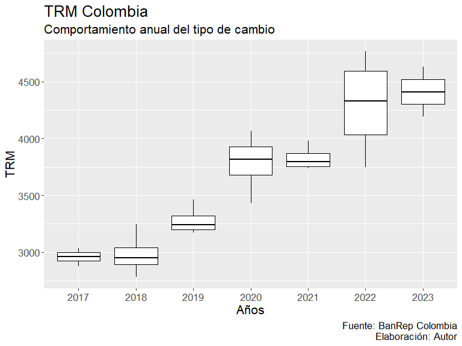
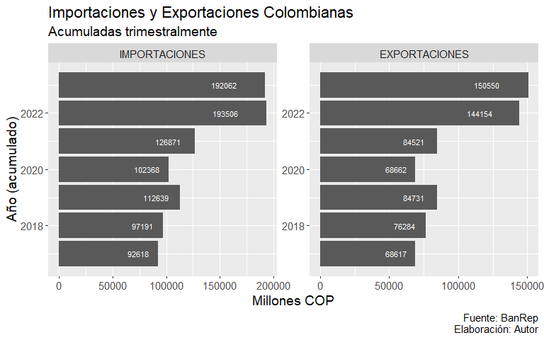
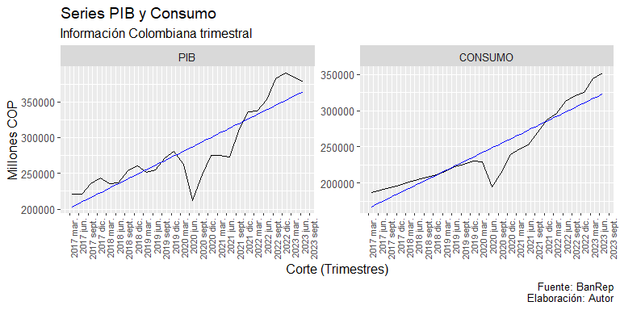

PROYECTO DE FIN DE MODULO 2
================
JUAN JOSE LEON
2023-11-14

``` r
library(openxlsx)
library(ggplot2)
library(lubridate)
library(dplyr)
library(gganimate)
library(animation)
library(reshape2)
library(dygraphs)
```

# BASE DE DATOS TRABAJADA

Se realiza la revisión de las variables importaciones, exportaciones,
PIB, TRM (Tipo de cambio), CONSUMO

``` r
datos <- read.xlsx("C:\\Users\\ASUS_PC\\Documents\\CURSOS RSTUDIO\\PROGRAMA EXPERTO EN CIENCIA DE DATOS\\ENTREGABLES Y TRABAJOS\\MODULO 2\\BASE DE DATOS COLOMBIA.xlsx", detectDates = T)

# Creando las nuevas variables de mes y año

datos <- datos %>% 
  mutate(anio = year(CORTE), mes = month(CORTE))
```

# GRAFICO BOXPLOT DE UNA VARIABLE

A continuación, se presenta un BoxPlot creado para la variable TRM

``` r
# Arreglando y depurando la base de datos a trabajar

baseboxplot <- datos %>% 
  select(anio, mes, everything()) %>% 
  select(-CORTE) %>% 
  group_by(anio)

# Creando el Boxplot

ggplot(baseboxplot, aes(x = factor(anio), y = TRM))+
  geom_boxplot(color = "black")+
  theme(text = element_text(size = 16))+
  labs(title = "TRM Colombia", subtitle = "Comportamiento anual del tipo de cambio",
       caption = "Fuente: BanRep Colombia\n Elaboración: Autor",
       x = "Años", y = "TRM")
```



# GRÁFICO DE BARRAS NO APILADAS

Se procede a realizar un gráfico para las variables exportaciones e
importaciones:

``` r
# Agrupando la base para esta gráfica

datosbarras <- datos %>% 
  filter(mes <= tail(datos$mes, n = 1)) %>%
  select(anio, IMPORTACIONES, EXPORTACIONES) %>%
  mutate(anio = as.numeric(anio)) %>% 
  group_by(anio) %>% 
  summarise_each(list(sum))

# Redondeando los decimales

datosbarras <- round(datosbarras,0)

# Generando la base tipo panel para las barras no apiladas

panelbarras <- melt(datosbarras, id.vars = "anio")

# Generando la gráfica de barras no apliadas de exportaciones e importaciones

ggplot(panelbarras, aes(x = anio, y= value))+
  facet_wrap(~variable, scales = "free")+
  geom_bar(stat = "identity")+
  coord_flip()+
  geom_text(aes(y = value, label = value), position = position_stack(vjust = 0.8), size = 3, color = "White")+
  labs(title = "Importaciones y Exportaciones Colombianas", subtitle = "Acumuladas trimestralmente",
       caption = "Fuente: BanRep\n Elaboración: Autor",
       x = "Año (acumulado)", y = "Millones COP")+
  theme(legend.position = "bottom", text = element_text(size = 14))
```



# GRÁFICO LINEAL DE DOS VARIABLES

Se realiza la graficación sobre las variables PIB y Consumo

``` r
# Construyendo la base a trabajar

datoslinea <- datos %>% 
  select(CORTE, PIB, CONSUMO)

# Ajustando la base a tipo panel

panellinea <- melt(datoslinea, id.vars = "CORTE")

# Graficando las series de tiempo

ggplot(data = panellinea, aes(x = CORTE, y = value))+
  geom_line()+
  facet_wrap(.~variable, scales = "free")+
  geom_smooth(method = "lm", color = "blue", se = F, alpha = 0.3, size = 0.5)+
  scale_x_date(date_labels = "%Y %b", breaks = "3 months")+
  theme(legend.position = "bottom", axis.text.x = element_text(angle = 90, hjust = 1, size = 8))+
  labs(title = "Series PIB y Consumo", subtitle = "Información Colombiana trimestral",
       caption = "Fuente: BanRep\n Elaboración: Autor",
       x = "Corte (Trimestres)", y = "Millones COP")+
  theme(legend.position = "bottom", text = element_text(size = 12))
```



# GRÁFICO DINÁMICO DE TRM

Se presenta un gráfico dinámico sobre la variable TRM como serie
histórica trimestral desde

Nota; Este chunk se desactiva para generar el github
