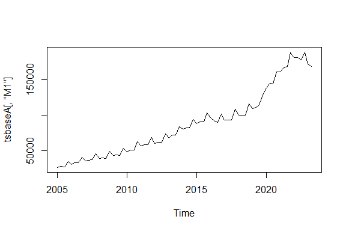
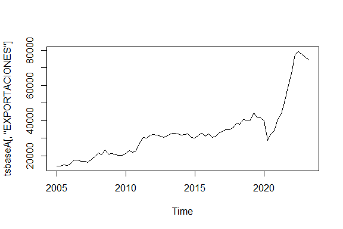
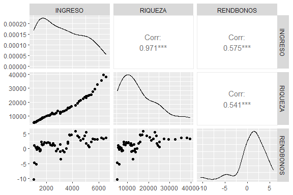
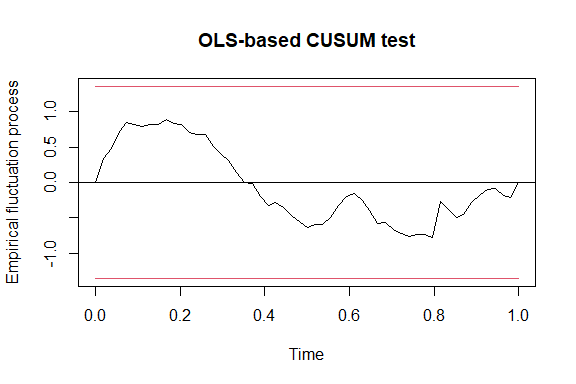
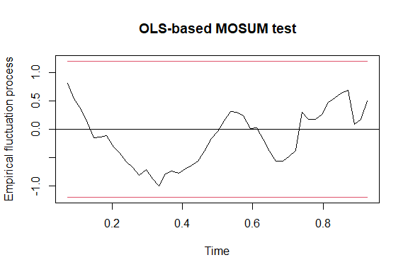

ENTREGABLE_MODULO3
================
JUAN JOSE LEON
2023-11-17

``` r
library(forecast)
library(dplyr)
library(openxlsx)
```

# SECCION A: MODELO DE TASA DE CRECIMIENTO PARA LA OFERTA MONETARIA Y LAS EXPORTACIONES

MODELO 1: TASA DE CRECIMIENTO DE LA MASA MONETARIA (M1)

Se estima el siguiente modelo:

ln(M1) = B0 + B1\*TREND + u

``` r
# Abriendo la base de datos

baseA <- read.xlsx("C:\\Users\\ASUS_PC\\Documents\\CURSOS RSTUDIO\\PROGRAMA EXPERTO EN CIENCIA DE DATOS\\ENTREGABLES Y TRABAJOS\\MODULO 3\\M1_EXPORTACIONES.xlsx", sheet = "BASE", detectDates = T)


# Generando los ln de cada variable:

baseA <- baseA %>% 
  mutate(lnM1 = log(M1),
         lnEXPORTACIONES = log(EXPORTACIONES))

# Transformando la base en una serie de tiempo (TRIMESTRAL)

tsbaseA <- ts(baseA, start = c(2005,1), frequency = 4)

#  Graficando la serie de tiempo M1

plot(tsbaseA[,"M1"])
```



``` r
# Estimando el modelo

tasaM1 <- tslm(lnM1 ~ trend, data = tsbaseA)
summary(tasaM1)
```


    Call:
    tslm(formula = lnM1 ~ trend, data = tsbaseA)

    Residuals:
          Min        1Q    Median        3Q       Max 
    -0.166626 -0.053193 -0.003319  0.064486  0.153876 

    Coefficients:
                 Estimate Std. Error t value Pr(>|t|)    
    (Intercept) 1.027e+01  2.062e-02  497.80   <2e-16 ***
    trend       2.567e-02  4.779e-04   53.72   <2e-16 ***
    ---
    Signif. codes:  0 '***' 0.001 '**' 0.01 '*' 0.05 '.' 0.1 ' ' 1

    Residual standard error: 0.08781 on 72 degrees of freedom
    Multiple R-squared:  0.9757,    Adjusted R-squared:  0.9753 
    F-statistic:  2886 on 1 and 72 DF,  p-value: < 2.2e-16

``` r
# Estimando la tasa de crecimiento relativa compuesta:

(exp(2.567e-02)-1)*100
```

    [1] 2.600231

Se puede concluir, que en promedio por trimestre, la Masa monetaria (M1)
se incrementa a razón de 2.60%

MODELO 2: TASA DE CRECIMIENTO DE LAS EXPORTACIONES

Se estima el siguiente modelo:

ln(EXPORTACIONES) = B0 + B1\*TREND + u

``` r
#  Graficando la serie de tiempo EXPORTACIONES

plot(tsbaseA[,"EXPORTACIONES"])
```



``` r
# Estimando el modelo

tasaEXPORTACIONES <- tslm(lnEXPORTACIONES ~ trend, data = tsbaseA)
summary(tasaEXPORTACIONES)
```


    Call:
    tslm(formula = lnEXPORTACIONES ~ trend, data = tsbaseA)

    Residuals:
         Min       1Q   Median       3Q      Max 
    -0.49835 -0.08893 -0.02850  0.10516  0.34972 

    Coefficients:
                 Estimate Std. Error t value Pr(>|t|)    
    (Intercept) 9.6271028  0.0367180  262.19   <2e-16 ***
    trend       0.0183725  0.0008508   21.59   <2e-16 ***
    ---
    Signif. codes:  0 '***' 0.001 '**' 0.01 '*' 0.05 '.' 0.1 ' ' 1

    Residual standard error: 0.1563 on 72 degrees of freedom
    Multiple R-squared:  0.8662,    Adjusted R-squared:  0.8644 
    F-statistic: 466.3 on 1 and 72 DF,  p-value: < 2.2e-16

``` r
# Estimando la tasa de crecimiento relativa compuesta:

(exp(0.0183725)-1)*100
```

    [1] 1.854231

Se puede concluir, que para la variable EXPORTACIONES hay una tasa de
crecimiento promedio trimestral de 1.85%

# SECCION B: MODELO DE REGRESIÓN MÚLTIPLE

Para esta sección, se usa un modelo en el cual se usan las variables del
Consumo, en función del ingreso disponible, la riqueza y los
rendimientos anuales de los bonos de EEUU, el modelo es de tipo:

consumo = B0 + B1(INGRESO) + B2(RIQUEZA) + B3(RENDBONOS) + u

``` r
# Importando la base de datos

baseB <- read.xlsx("C:\\Users\\ASUS_PC\\Documents\\CURSOS RSTUDIO\\PROGRAMA EXPERTO EN CIENCIA DE DATOS\\ENTREGABLES Y TRABAJOS\\MODULO 3\\GASTO DE CONSUMO REAL.xlsx", sheet = "BASE",detectDates = T)

# Estimando el modelo de regresión multiple

regmultiple <- lm(CONSUMO ~ INGRESO + RIQUEZA + RENDBONOS, data = baseB)
summary(regmultiple)
```


    Call:
    lm(formula = CONSUMO ~ INGRESO + RIQUEZA + RENDBONOS, data = baseB)

    Residuals:
        Min      1Q  Median      3Q     Max 
    -89.575 -26.584  -2.067  16.256 265.503 

    Coefficients:
                  Estimate Std. Error t value Pr(>|t|)    
    (Intercept) -25.078316  18.484731  -1.357    0.181    
    INGRESO       0.745502   0.019835  37.584  < 2e-16 ***
    RIQUEZA       0.034012   0.003573   9.520 8.18e-13 ***
    RENDBONOS    -2.998489   3.278809  -0.915    0.365    
    ---
    Signif. codes:  0 '***' 0.001 '**' 0.01 '*' 0.05 '.' 0.1 ' ' 1

    Residual standard error: 54.31 on 50 degrees of freedom
    Multiple R-squared:  0.9988,    Adjusted R-squared:  0.9987 
    F-statistic: 1.358e+04 on 3 and 50 DF,  p-value: < 2.2e-16

INTERPRETACIÓN DE LOS COEFICIENTES ESTIMADOS:

Al realizar la estimación se encontraron los siguientes hallazgos para
cada variable;

1)  INGRESO; Presenta una relación directa con la evolución del consumo,
    ya que por cada unidad de aumento en el ingreso, el consumo
    incrementa en 0.75 unidades. Este coeficiente es estadísticamente
    significativo a un nivel de confianza del 99%.

2)  RIQUEZA; Presenta una significancia estadística con un nivel de
    confianza del 99%. Demuestra una relació directa con la variable
    explicada, ya que por cada aumento de una unidad en la riqueza el
    consumo incrementa en 0.034 unidades.

3)  RENDBONOS; Si bien demuestra una relación inversa, ya que mientras
    el rendimiento anual de los bonos aumenta en una unidad (100 p.b) el
    consumo decrece en 2.99 unidades. Se observa que esta variable no es
    estadísticamente significativa.

SIGNIFICANCIA GLOBAL DEL MODELO

Se observa un estadístico F de 1.358e+04 y un p-value de 2.2e-16,
concluyendo que de manera global el modelo es estadísticamente
significativo a un nivel de confianza del 95%.

Así mismo, el coeficiente de determinación ajustado (R^2 ajustado) es
del 99.87%.

Para corroborar estos valores, se procede a realizar a continuación los
contrastes de los supuestos de MCO.

# PRUEBAS DE AUTOCORRELACIÓN

Probando los contrastes de autocorrelación:

``` r
library(dynlm)
library(nlme)
library(forecast)
library(sandwich)
library(car)
library(ggplot2)
library(lmtest)

# Ho = No hay autocorrelación
# H1 = Si hay autocorrelación

# 1) DURBIN WATSON

dwtest(regmultiple)
```


        Durbin-Watson test

    data:  regmultiple
    DW = 1.9255, p-value = 0.2552
    alternative hypothesis: true autocorrelation is greater than 0

``` r
# 2) CONTRASTE BG (Breusch-Godfrey)

# Probandolo con orden 1

bgtest(regmultiple, order = 1)
```


        Breusch-Godfrey test for serial correlation of order up to 1

    data:  regmultiple
    LM test = 0.011659, df = 1, p-value = 0.914

1)  DURBIN WATSON: P-value de 0.2552, por lo cual se acepta la hipótesis
    nula de que el modelo NO tiene problemas de autocorrelación.El DW
    calculado fue de 1.9255 y se podría indicar tiende a 2 por ende no
    hay autocorrelación.
2)  BG de orden 1: P - value de 0.914; se acepta la hipotesis nula,
    concluyendo que NO hay autocorrelación de orden 1.

# PRUEBAS DE HETEROCEDASTICIDAD

Probando los problemas de hetorocedasticidad:

``` r
# H0 = Homocedasticidad
# H1 = Heterocedasticidad

# 1) CONTRASTE BREUSH PAGAN (BP)

bptest(regmultiple, data = reg)
```


        studentized Breusch-Pagan test

    data:  regmultiple
    BP = 5.7642, df = 3, p-value = 0.1237

``` r
# 2) NON CONSTANT ERROR VARIANCE

ncvTest(regmultiple)
```

    Non-constant Variance Score Test 
    Variance formula: ~ fitted.values 
    Chisquare = 28.68425, Df = 1, p = 8.5194e-08

``` r
# 3) METODO GLEJSER

glejser1 <- lm(abs(regmultiple$residuals) ~ INGRESO, data = baseB)
summary(glejser1)
```


    Call:
    lm(formula = abs(regmultiple$residuals) ~ INGRESO, data = baseB)

    Residuals:
        Min      1Q  Median      3Q     Max 
    -57.397 -15.590  -1.483   9.365 210.937 

    Coefficients:
                Estimate Std. Error t value Pr(>|t|)    
    (Intercept) -4.81874   10.94365  -0.440 0.661529    
    INGRESO      0.01184    0.00304   3.895 0.000282 ***
    ---
    Signif. codes:  0 '***' 0.001 '**' 0.01 '*' 0.05 '.' 0.1 ' ' 1

    Residual standard error: 36.14 on 52 degrees of freedom
    Multiple R-squared:  0.2259,    Adjusted R-squared:  0.211 
    F-statistic: 15.17 on 1 and 52 DF,  p-value: 0.0002816

``` r
glejser2 <- lm(abs(regmultiple$residuals) ~ RIQUEZA, data = baseB)
summary(glejser2)
```


    Call:
    lm(formula = abs(regmultiple$residuals) ~ RIQUEZA, data = baseB)

    Residuals:
        Min      1Q  Median      3Q     Max 
    -53.992 -14.436  -3.145  10.142 215.708 

    Coefficients:
                  Estimate Std. Error t value Pr(>|t|)    
    (Intercept) -0.0435219 10.0261735  -0.004  0.99655    
    RIQUEZA      0.0021573  0.0005651   3.818  0.00036 ***
    ---
    Signif. codes:  0 '***' 0.001 '**' 0.01 '*' 0.05 '.' 0.1 ' ' 1

    Residual standard error: 36.31 on 52 degrees of freedom
    Multiple R-squared:  0.2189,    Adjusted R-squared:  0.2039 
    F-statistic: 14.57 on 1 and 52 DF,  p-value: 0.0003604

``` r
glejser3 <- lm(abs(regmultiple$residuals) ~ RENDBONOS, data = baseB)
summary(glejser3)
```


    Call:
    lm(formula = abs(regmultiple$residuals) ~ RENDBONOS, data = baseB)

    Residuals:
        Min      1Q  Median      3Q     Max 
    -46.963 -19.307  -7.406  10.023 209.246 

    Coefficients:
                Estimate Std. Error t value Pr(>|t|)    
    (Intercept)   26.654      5.716   4.663 2.21e-05 ***
    RENDBONOS      5.291      1.884   2.808  0.00701 ** 
    ---
    Signif. codes:  0 '***' 0.001 '**' 0.01 '*' 0.05 '.' 0.1 ' ' 1

    Residual standard error: 38.28 on 52 degrees of freedom
    Multiple R-squared:  0.1317,    Adjusted R-squared:  0.115 
    F-statistic: 7.884 on 1 and 52 DF,  p-value: 0.007006

1)  CONTRASTE BREUSH - PAGAN: Se obtiene un p-value de 0.1237, por lo
    cual no se rechaza la hipótesis nula y se concluye que no hay
    problemas de heterocedasticidad.

2)  CONTRASTE NCEV: Se presentó un p-value de 8.5194e-08, por lo cual se
    rechaza la hipótesis nula y se acepta que el modelo si tiene
    problemas de heterocedasticidad.

Probando si hay heterocedasticidad en función de cada una de las
variables explicativas con el método Glejser se obtuvieron los
siguientes resultados:

INGRESO: Coeficiente 0.01184 y p-value de 0.000282 RIQUEZA: Coeficiente
0.0021573 y p-value de 0.00036 RENDBONOS: Coeficiente 5.291 y p-value de
0.00701

Por ende, la de mayor significancia fue la variable INGRESO, siendo la
posible causa del problema de heterocedasticidad.

# PRUEBAS DE MULTICOLINEALIDAD

Se procede a realizar las pruebas de multicolinealidad:

``` r
library(GGally)

# 1) MATRIZ DE CORRELACIONES

ggpairs(baseB[3:5])
```



``` r
# 2) FACTOR DE INFLACIÓN DE LA VARIANZA

# Si es mayor que 10 existe un problema severo de multicolinealidad

vif(regmultiple)
```

      INGRESO   RIQUEZA RENDBONOS 
     18.84895  17.86003   1.50415 

1)  Matriz de Correlaciones; se observa que las variables INGRESO y
    RIQUEZA están altamente correlacionadas, con un coeficiente de 0.971
2)  VIF: Las variables Ingreso y Riqueza tienen valores de 18.85 y de
    17.86 presentando problemas serios de multicolinealidad

# ATENUANDO LOS PROBLEMAS DEL MODELO (HETEROCEDASTICIDAD Y MULTICOLINEALIDAD)

Se procede a realizar la siguiente estimación:

1)  Se crea una nueva variable llamada RIQUEZAINGRESO que se calculó
    como el logaritmo natural del ratio RIQUEZA/INGRESO
2)  Se estima la regresión: ln(CONSUMO) = ln(INGRESO) +
    ln(RIQUEZA/INGRESO) + u
3)  Con esa modificación se solucionan los problemas de
    Heterocedasticidad y de Multicolinealidad pero se genera un nuevo
    problema que es la autocorrelación. Para atenuar este caso lo mejor
    es realizar la estimación por medio de errores estandar libres de
    autocorrelación.

Los resultados finales indican que el modelo en su conjunto es
significativo con un p-value de 2.2e-16 y un R^2 ajustado de 0.99% y así
mismo, se mantiene la significancia estadística e cada uno de los
coeficientes por medio del método de errores estandar libres de
autocorrelación.

``` r
# Estimando el modelo en logaritmos

baseB <- baseB %>% 
  mutate(RIQUEZAINGRESO = log(RIQUEZA/INGRESO))

regln <- lm(log(CONSUMO) ~ log(INGRESO) + RIQUEZAINGRESO, data = baseB)
summary(regln)
```


    Call:
    lm(formula = log(CONSUMO) ~ log(INGRESO) + RIQUEZAINGRESO, data = baseB)

    Residuals:
          Min        1Q    Median        3Q       Max 
    -0.020440 -0.011282 -0.002373  0.005615  0.058671 

    Coefficients:
                    Estimate Std. Error t value Pr(>|t|)    
    (Intercept)    -0.404412   0.048807  -8.286 5.21e-11 ***
    log(INGRESO)    1.000005   0.003884 257.477  < 2e-16 ***
    RIQUEZAINGRESO  0.190514   0.022878   8.327 4.49e-11 ***
    ---
    Signif. codes:  0 '***' 0.001 '**' 0.01 '*' 0.05 '.' 0.1 ' ' 1

    Residual standard error: 0.01564 on 51 degrees of freedom
    Multiple R-squared:  0.9992,    Adjusted R-squared:  0.9992 
    F-statistic: 3.32e+04 on 2 and 51 DF,  p-value: < 2.2e-16

``` r
# AUTOCORRELACION

# 1) DURBIN WATSON

dwtest(regln)
```


        Durbin-Watson test

    data:  regln
    DW = 1.2912, p-value = 0.001355
    alternative hypothesis: true autocorrelation is greater than 0

``` r
# 2) CONTRASTE BG (Breusch-Godfrey)

bgtest(regln, order = 1)
```


        Breusch-Godfrey test for serial correlation of order up to 1

    data:  regln
    LM test = 4.0804, df = 1, p-value = 0.04338

``` r
# SOLUCIONANDO AUTOCORRELACIÓN POR MEDIO DE ERRORES ESTANDAR LIBRES DE AUTOCORRELACIÓN

coeftest(regln, vcov = NeweyWest(regln))
```


    t test of coefficients:

                     Estimate Std. Error  t value  Pr(>|t|)    
    (Intercept)    -0.4044118  0.0462318  -8.7475 1.006e-11 ***
    log(INGRESO)    1.0000054  0.0035676 280.2988 < 2.2e-16 ***
    RIQUEZAINGRESO  0.1905144  0.0273374   6.9690 6.092e-09 ***
    ---
    Signif. codes:  0 '***' 0.001 '**' 0.01 '*' 0.05 '.' 0.1 ' ' 1

``` r
# HETEROCEDASTICIDAD 

# 1) CONTRASTE BREUSH PAGAN (BP)

bptest(regln, data = reg)
```


        studentized Breusch-Pagan test

    data:  regln
    BP = 0.059359, df = 2, p-value = 0.9708

``` r
# 2) NON CONSTANT ERROR VARIANCE

ncvTest(regln)
```

    Non-constant Variance Score Test 
    Variance formula: ~ fitted.values 
    Chisquare = 0.05525088, Df = 1, p = 0.81417

``` r
# Conclusión; no hay heterocedasticidad


# MULTICOLINEALIDAD

# 1) FACTOR DE INFLACIÓN DE LA VARIANZA

# Si es mayor que 10 existe un problema severo de multicolinealidad

vif(regln)
```

      log(INGRESO) RIQUEZAINGRESO 
          1.005114       1.005114 

# APLICANDO CONTRASTES DE ESTABILIDAD SOBRE EL MODELO FINAL

Se aplican los siguientes contrastes de estabilidad:

``` r
library(strucchange)

# CUSUM

medcusum <- efp(regln, data = baseB, type = "OLS-CUSUM")
plot(medcusum)
```



``` r
# MOSUM

medmosum <- efp(regln, data = baseB, type = "OLS-MOSUM")
plot(medmosum)
```



``` r
# PRUEBA FORMAL DE CUSUM TEST

# H0: no cambio estructural
# H1: Si hay cambio estructural

sctest(regln, type = "OLS-CUSUM", data = baseB)
```


        M-fluctuation test

    data:  regln
    f(efp) = 1.1711, p-value = 0.3386

``` r
# En este caso el p-value es de 0.002321 y por ende se rechaza la hipotesis nula y se acepta la alternativa, concluyendo
# que SI HAY CAMBIO ESTRUCTURAL
```

1)  Con las gráficas CUSUM y MOSUM se observa que existe estabilidad en
    los coeficientes estimados
2)  Con la prueba formal CUSUM test se encuentra un p-value de 0.3386
    por lo cual se puede concluir que no existe cambio estrucural en el
    modelo.
