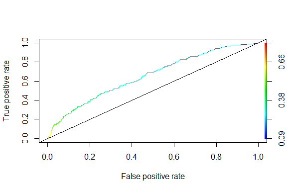
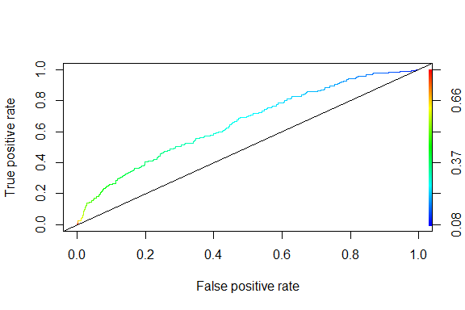
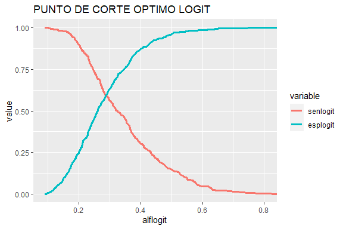
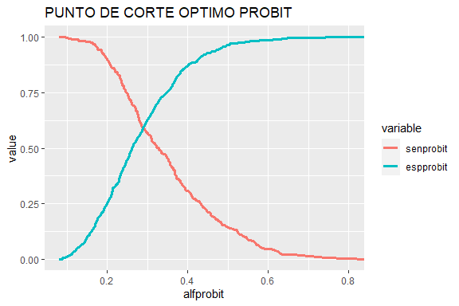

PROYECTO_MOD4_MODELOSPREDCTIVOS_PARTE2
================
JUAN JOSE LEON
2023-11-27

# LLAMANDO LAS LIBRERÍAS Y DEPURANDO LA BASE DE DATOS

``` r
# Cargando librerías

library(dplyr)
library(foreign)
library(gmodels)
library(ResourceSelection)
library(ROCR)
library(Epi)
library(QuantPsyc)
library(ggplot2)
library(memisc)

# Cargando la base de datos

datos <- read.csv("C:\\Users\\ASUS_PC\\Documents\\CURSOS RSTUDIO\\PROGRAMA EXPERTO EN CIENCIA DE DATOS\\BASES_DATOS_BASES\\MODULO 4 MODELOS PREDICTIVOS II\\Base-y-presentacion_4681YE\\germancredit.csv")

# Seleccionando las variables definitivas para trabajar los modelos

names(datos)
```

     [1] "Default"         "checkingstatus1" "duration"        "history"        
     [5] "purpose"         "amount"          "savings"         "employ"         
     [9] "installment"     "status"          "others"          "residence"      
    [13] "property"        "age"             "otherplans"      "housing"        
    [17] "cards"           "job"             "liable"          "tele"           
    [21] "foreign"        

``` r
datos <- datos[c("Default", "duration", "amount", "installment", "age","cards")]

datos <- datos %>% 
  mutate(edad2 = age * age)
```

# CONSTRUYENDO LOS MODELOS LOGIT Y PROBIT

``` r
# estimando los modelos logit y probit

# ----1) MODELO LOGIT----

logit <- glm(Default ~ ., family = binomial(logit), data = datos)
summary(logit)
```


    Call:
    glm(formula = Default ~ ., family = binomial(logit), data = datos)

    Coefficients:
                  Estimate Std. Error z value Pr(>|z|)    
    (Intercept)  3.799e-01  7.400e-01   0.513 0.607706    
    duration     2.695e-02  7.714e-03   3.494 0.000475 ***
    amount       7.346e-05  3.407e-05   2.156 0.031076 *  
    installment  2.165e-01  7.290e-02   2.970 0.002978 ** 
    age         -1.202e-01  3.775e-02  -3.184 0.001454 ** 
    cards       -1.228e-01  1.301e-01  -0.944 0.345172    
    edad2        1.227e-03  4.499e-04   2.727 0.006386 ** 
    ---
    Signif. codes:  0 '***' 0.001 '**' 0.01 '*' 0.05 '.' 0.1 ' ' 1

    (Dispersion parameter for binomial family taken to be 1)

        Null deviance: 1221.7  on 999  degrees of freedom
    Residual deviance: 1152.1  on 993  degrees of freedom
    AIC: 1166.1

    Number of Fisher Scoring iterations: 4

``` r
# ----2) MODELO PROBIT----  

probit <- glm(Default ~ ., family = binomial(probit), data = datos)
summary(probit)
```


    Call:
    glm(formula = Default ~ ., family = binomial(probit), data = datos)

    Coefficients:
                  Estimate Std. Error z value Pr(>|z|)    
    (Intercept)  1.942e-01  4.445e-01   0.437 0.662136    
    duration     1.656e-02  4.688e-03   3.533 0.000411 ***
    amount       4.386e-05  2.073e-05   2.116 0.034379 *  
    installment  1.271e-01  4.310e-02   2.949 0.003189 ** 
    age         -7.078e-02  2.252e-02  -3.143 0.001674 ** 
    cards       -7.333e-02  7.674e-02  -0.956 0.339257    
    edad2        7.200e-04  2.682e-04   2.684 0.007269 ** 
    ---
    Signif. codes:  0 '***' 0.001 '**' 0.01 '*' 0.05 '.' 0.1 ' ' 1

    (Dispersion parameter for binomial family taken to be 1)

        Null deviance: 1221.7  on 999  degrees of freedom
    Residual deviance: 1151.9  on 993  degrees of freedom
    AIC: 1165.9

    Number of Fisher Scoring iterations: 4

# CONTRASTES HOSMER - LEMESHOW

``` r
# H0: El modelo tiene bondad de ajuste
# H1: El modelo NO tiene bondad de ajuste


# ----1) MODELO LOGIT ----

hllogit <- hoslem.test(datos$Default, fitted(logit), g = 10)

hllogit
```


        Hosmer and Lemeshow goodness of fit (GOF) test

    data:  datos$Default, fitted(logit)
    X-squared = 7.6569, df = 8, p-value = 0.4677

``` r
# Se puede observar que este contraste arroja un p-value de 0.4677, por lo cual se puede aceptar la hipótesis nula y se concluye que el
# modelo logit SI tiene bondad de ajuste


# ----2) MODELO PROBIT----

hlprobit <- hoslem.test(datos$Default, fitted(probit), g = 10)

hlprobit
```


        Hosmer and Lemeshow goodness of fit (GOF) test

    data:  datos$Default, fitted(probit)
    X-squared = 8.0644, df = 8, p-value = 0.4272

``` r
# En el modelo probit, se obtiene un p-value de 0.4272, por lo cual se acepta la hipótesis nula y se concluye que el modelo sí tiene
# bondad de ajuste
```

# MATRIZ DE CONFUSIÓN, CURVAS ROC Y ÁREAS BAJO LA CURVA

1)  MATRIZ DE CLASIFICACIÓN

``` r
# Definiendo el umbral como el promedio de las probabilidades calculadas:

thresholdlogit <- mean(fitted(logit))
thresholdprobit <- mean(fitted(probit))


# TABLAS DE CLASIFICACION

# ----1) MODELO LOGIT----

ClassLog(logit, datos$Default, cut = thresholdlogit)
```

    $rawtab
           resp
              0   1
      FALSE 444 132
      TRUE  256 168

    $classtab
           resp
                    0         1
      FALSE 0.6342857 0.4400000
      TRUE  0.3657143 0.5600000

    $overall
    [1] 0.612

    $mcFadden
    [1] 0.05696396

``` r
# Conclusión: Al revisar la capacidad de clasificación global del modelo, se obtiene un Overall del 61.2%; se puede validar que 
# la capacidad predictiva sobre las observaciones clasificadas como 0 tiene un acierto de 63.43%, mientras que la capacidad de predecir
# los valores clasificados como 1 es del 56%


# ----2) MODELO PROBIT----

ClassLog(probit, datos$Default, cut = thresholdprobit)
```

    $rawtab
           resp
              0   1
      FALSE 439 130
      TRUE  261 170

    $classtab
           resp
                    0         1
      FALSE 0.6271429 0.4333333
      TRUE  0.3728571 0.5666667

    $overall
    [1] 0.609

    $mcFadden
    [1] 0.05716079

``` r
# Conclusión; en este modelo, la capacidad de clasificación total (overall) es del 60.9%, presentando también una inclinación a predecir
# de mejor manera los valores 0 que los 1


# Por ahora, se obseva que utilizando la matriz de confusión, el modelo logit tiene una mejor capacidad de predicción global
```

2)  CURVAS ROC Y ÁREAS BAJO LA CURVA

``` r
# ---- 2.1) CURVA ROC MODELO LOGIT----

predlogit <- prediction(logit$fitted.values, datos$Default)

perflogit <- performance(predlogit, measure = "tpr", x.measure = "fpr")

plot(perflogit, colorize = T, lyt = 3)
abline(0, 1, col = "black")
```



``` r
# El área bajo la curva para el modelo logit corresponde a: 65.58952%

auclogit <- performance(predlogit, measure = "auc")
auclogit <- auclogit@y.values[[1]]
auclogit
```

    [1] 0.6558952

``` r
# ---- 2.2) CURVA ROC MODELO PROBIT----

predprobit <- prediction(probit$fitted.values, datos$Default)

perfprobit <- performance(predprobit, measure = "tpr", x.measure = "fpr")

plot(perfprobit, colorize = T, lyt = 3)
abline(0, 1, col = "black")
```



``` r
# El área bajo la curva para el modelo probit corresponde a: 65.57667%

aucprobit <- performance(predprobit, measure = "auc")
aucprobit <- aucprobit@y.values[[1]]
aucprobit
```

    [1] 0.6557667

``` r
# CONCLUSIÓN: utilizando la curva ROC y el área bajo la curva, también se concluye que el mejor modelo es el Logit
```

# PUNTO DE CORTE ÓPTIMO PARA CADA MODELO

``` r
# Usando las siguientes librerías

library(reshape2)
library(gridExtra)
library(plotly)

# ----1) MODELO LOGIT ----

perflogit2 <- performance(predlogit, "sens", "spec")

senlogit <- slot(perflogit2, "y.values"[[1]])

esplogit <- slot(perflogit2, "x.values"[[1]])

alflogit <- slot(perflogit2, "alpha.values"[[1]])

# Generando una matriz con los objetos alf, sen, esp (alpha, sensitividad y especificidad) y renombrandolos

matlogit <- data.frame(alflogit, senlogit, esplogit)
names(matlogit)[1] <- "alflogit"
names(matlogit)[2] <- "senlogit"
names(matlogit)[3] <- "esplogit"

# Convirtiendo la mariz creada (matlogit) en tipo panel dejando como id o primera columna a "alf

mlogit <- melt(matlogit, id=c("alflogit"))

# Graficando

plogit <- ggplot(mlogit, aes(alflogit, value, group = variable, colour = variable))+
  geom_line(size = 1.2) +
  labs(title = "PUNTO DE CORTE OPTIMO LOGIT")

# CONCLUSIÓN: Con la siguiente gráfica, se puede concluir que el punto óptimo como umbral del modelo LOGIT es 28.7533%

thresholdlogitfinal <- 0.287533

plogit
```



``` r
# ggplotly(plogit)


# ----2) MODELO PROBIT ----

perfprobit2 <- performance(predprobit, "sens", "spec")

senprobit <- slot(perfprobit2, "y.values"[[1]])

espprobit <- slot(perfprobit2, "x.values"[[1]])

alfprobit <- slot(perfprobit2, "alpha.values"[[1]])

# Generando una matriz con los objetos alf, sen, esp (alpha, sensitividad y especificidad) y renombrandolos

matprobit <- data.frame(alfprobit, senprobit, espprobit)
names(matprobit)[1] <- "alfprobit"
names(matprobit)[2] <- "senprobit"
names(matprobit)[3] <- "espprobit"

# Convirtiendo la mariz creada (matprobit) en tipo panel dejando como id o primera columna a "alf

mprobit <- melt(matprobit, id=c("alfprobit"))

# Graficando

pprobit <- ggplot(mprobit, aes(alfprobit, value, group = variable, colour = variable))+
  geom_line(size = 1.2) +
  labs(title = "PUNTO DE CORTE OPTIMO PROBIT")

# CONCLUSIÓN: Con la siguiente gráfica, se puede concluir que el punto óptimo como umbral del modelo PROBIT es 28.9087%

thresholdprobitfinal <- 0.289087

pprobit
```



``` r
# ggplotly(pprobit)
```

# TABLAS DE CLASIFICACIÓN UTILIZANDO EL PUNTO ÓPTIMO CALCULADO PARA CADA MODELO

``` r
# ----1) MODELO LOGIT----

ClassLog(logit, datos$Default, cut = thresholdlogitfinal)
```

    $rawtab
           resp
              0   1
      FALSE 414 123
      TRUE  286 177

    $classtab
           resp
                    0         1
      FALSE 0.5914286 0.4100000
      TRUE  0.4085714 0.5900000

    $overall
    [1] 0.591

    $mcFadden
    [1] 0.05696396

``` r
# Para el modelo logit, utilizando el umbral óptimo se tiene un porcentaje de clasificación global del 59.1% y las 
# clasificaciones tanto de los 0 como de los 1 tiende a un 59% de clasificación correcta


# ----2) MODELO PROBIT----

ClassLog(probit, datos$Default, cut = thresholdprobitfinal)
```

    $rawtab
           resp
              0   1
      FALSE 416 122
      TRUE  284 178

    $classtab
           resp
                    0         1
      FALSE 0.5942857 0.4066667
      TRUE  0.4057143 0.5933333

    $overall
    [1] 0.594

    $mcFadden
    [1] 0.05716079

``` r
# El modelo logit, una vez ajustado el umbral óptimo presenta un 59.4% de clasificación global
# Respecto a los 1 y los 0 presenta unos porcentajes de clasificación correcta de 59.33% y 29.43% respectivamente
```

# PRONÓSTICOS REALIZADOS FUERA DE LA MUESTRA

``` r
# Construyendo una nueva base con una observación adicional para el pronóstico

names(datos)
```

    [1] "Default"     "duration"    "amount"      "installment" "age"        
    [6] "cards"       "edad2"      

``` r
newdata <- data.frame(duration = 18, amount = 3500, installment = 2, age = 28, cards = 1, edad2 = (28*28))

# Haciendo las predicciones con cada modelo: 

# ----1) MODELO LOGIT----

predict(logit, newdata, type = "response")
```

           1 
    0.274714 

``` r
# La probabilidad de que el deudor incumpla es del 27.47% con el modelo logit


# ----2) MODELO PROBIT----

predict(probit, newdata, type = "response")
```

            1 
    0.2773502 

``` r
# La probabilidad de que el deudor incumpla es del 27.73% con el modelo logit
```

# MODELO SELECCIONADO POR EL INVESTIGADOR

Si bien, una vez determinado el punto o umbral óptimo de corte, se
estableció que el modelo con una mayor capacidad predictiva era el
Probit, se selecciona al modelo logit como herramienta final de
pronóstico.

Lo anterior, por cuanto el criterio de Hosmer - Lemeshow favorece al
modelo logit, y así mismo, por cuanto presenta una mayor facilidad para
la transformación de los datos obtenidos y de interpretación.
