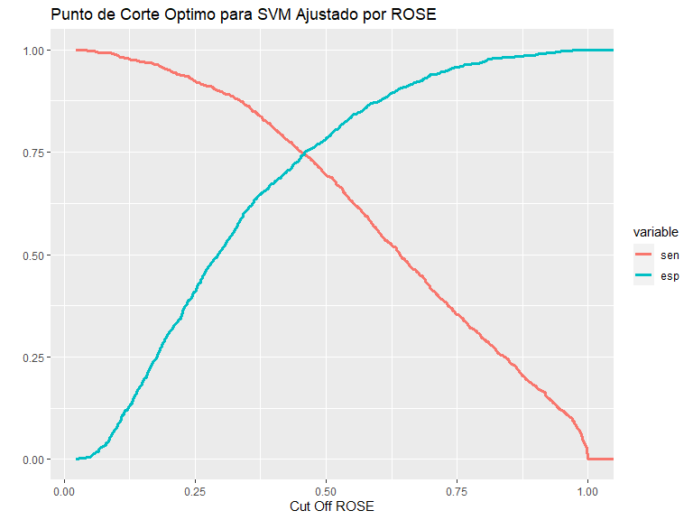

PROYECTO MODULO 6
================
JUAN JOSE LEON
2023-12-02

# TRATAMIENTO PREVIO DE LA BASE DE DATOS

Se procede a depurar y a transformar la base para que quede como la
variable a expliar el “peso” por medio de las variables “talla”,
“sem_gest”, “sexo”, “edad_mad”, “sabe_leer”, “con_pren” y “edad2”.

``` r
# Cargando librerías

library(foreign)
library(dplyr)
library(caret)
library(ROCR)
library(e1071)
library(reshape2)
library(plotly)
library(pROC)
library(ROSE)

# Cargando la base de datos y filtrando por la provincia Manabí cuya codificación es 13

datos <- read.spss("C:\\Users\\ASUS_PC\\Documents\\CURSOS RSTUDIO\\PROGRAMA EXPERTO EN CIENCIA DE DATOS\\BASES_DATOS_BASES\\MODULO 6 MACHINE LEARNING II\\machine learning\\ENCUESTA NACIDOS VIVOS\\ENV_2017.sav",
                   use.value.labels = F, to.data.frame = T)


# TRANSFORMANDO VARIABLES A TIPO NUMERICO

datos$prov_nac <- as.numeric(as.character(datos$prov_nac))
datos$peso <- as.numeric(datos$peso)
datos$talla <- as.numeric(datos$talla)
datos$sem_gest <- as.numeric(datos$sem_gest)
datos$edad_mad <- as.numeric(datos$edad_mad)
datos$con_pren <- as.numeric(datos$con_pren)


# FIltrando por la provincia Manabí (codigo 13) y depurando los datos faltantes 

nuevadata <- datos %>% 
  filter(prov_nac == 13) %>% 
  select(peso, talla, sem_gest, sexo, edad_mad, sabe_leer, con_pren) %>% 
  filter(peso != 99, talla != 99, sem_gest != 99, con_pren != 99, sabe_leer != 9)


# MODIFICANDO LA VARIABLE EXPLICADA PARA CATEGORIZARLA DE LA SIGUIENTE MANERA:
# 1 para los casos en que el peso sea superior a 2500, lo cual se considera un peso adecuado
# 0 para lo contrario

# Se convierte en una variable categorica de 1 y 0 así: Si peso es > 2500 coloque 1 (peso adecuado) y en caso contrario 0

nuevadata <- nuevadata %>% 
  mutate(peso = if_else(peso > 2500, 1, 0),
         sexo = if_else(sexo == 1, 0, 1),
         sabe_leer = if_else(sabe_leer == 1, 1, 0),
         con_pren = if_else(con_pren >= 7, 1, 0),
         edad2 = edad_mad^2)

# Transformando la variable explicada (peso) a tipo factor

nuevadata$peso <- factor(nuevadata$peso)


# Recodificando la variable explicada así:
# Si es 1 se recodifica por la leyenda "adecuado"
# Si es 0 se codifica en "no.adecuado"

nuevadata <- nuevadata %>% 
  mutate(peso = recode_factor(peso, '0' = "no.adecuado", '1' = "adecuado"))

# Comprobando la base a  trabajar

table(nuevadata$peso)
```


    no.adecuado    adecuado 
           2299       21676 

``` r
str(nuevadata)
```

    'data.frame':   23975 obs. of  8 variables:
     $ peso     : Factor w/ 2 levels "no.adecuado",..: 2 2 2 2 2 2 2 2 2 1 ...
     $ talla    : num  52 51 49 50 50 49 48 50 51 46 ...
     $ sem_gest : num  40 41 40 39 39 39 38 37 38 35 ...
     $ sexo     : num  1 0 1 0 1 1 0 0 1 1 ...
     $ edad_mad : num  19 15 27 24 19 32 23 17 24 40 ...
     $ sabe_leer: num  1 1 1 1 1 1 1 1 1 1 ...
     $ con_pren : num  0 1 1 0 1 0 0 0 0 0 ...
     $ edad2    : num  361 225 729 576 361 ...
     - attr(*, "variable.labels")= Named chr [1:47] "SecRegistroCivil P2 Provincia de inscripción" "SecRegistroCivil P2 Cantón de inscripción" "SecRegistroCivil P2 Parroquia de inscripción" "SecRegistroCivil P3 Año de inscripción" ...
      ..- attr(*, "names")= chr [1:47] "prov_insc" "cant_insc" "parr_insc" "anio_insc" ...
     - attr(*, "codepage")= int 1252

# PARTICIONANDO LA BASE

Se determina como muestra de entrenamiento para fines del ejercicio el
10% de la base total.

``` r
# FIJANDO LA SEMILLA PARA PARTICIONAR LA MUESTRA

set.seed(1234)

# PARTICIONANDO LA MUESTRA DE ENTRENAMIENTO (10%)

entrenamiento <- createDataPartition(nuevadata$peso, p = 0.10, list = F)
```

# SECCIÓN A: ESTIMACIÓN DEL MODELO SVM

Se realiza la estimación optimizando el hiperparámetro del Costo por
medio de validación cruzada. Así mismo, se utiliza un Kernel lineal para
facilitar el proceso de cálculo.

``` r
# Estimando el modelo 

modelo.tuneado <- tune(svm, peso ~ .,
                       data = nuevadata[entrenamiento,],
                       ranges = list(cos = c(0.001, 0.01, 0.1, 1, 5, 10, 50)),
                       kernel = "linear", scale = T, probability = T)

summary(modelo.tuneado)
```


    Parameter tuning of 'svm':

    - sampling method: 10-fold cross validation 

    - best parameters:
     cos
     0.1

    - best performance: 0.08799338 

    - Detailed performance results:
        cos      error dispersion
    1 1e-03 0.09592050 0.01118647
    2 1e-02 0.09091876 0.01407936
    3 1e-01 0.08799338 0.01155744
    4 1e+00 0.08841004 0.01225911
    5 5e+00 0.08841004 0.01225911
    6 1e+01 0.08841004 0.01225911
    7 5e+01 0.08841004 0.01225911

``` r
# Se identifica que el costo que optimiza el modelo es de 0.1; esto se puede comprobar con la siguiente gráfica:

ggplot(data = modelo.tuneado$performances,
       aes(x = cos, y = error))+
  geom_line()+
  geom_point()+
  labs(title = "Error de validación Vs. Hiperparámetro C (Costo)")+
  theme_bw()+
  theme(plot.title = element_text(hjust = 0.5))
```


``` r
# Estimando el mejor modelo con el costo de 0.1

mejor.modelo <- modelo.tuneado$best.model

summary(mejor.modelo)
```


    Call:
    best.tune(METHOD = svm, train.x = peso ~ ., data = nuevadata[entrenamiento, 
        ], ranges = list(cos = c(0.001, 0.01, 0.1, 1, 5, 10, 50)), kernel = "linear", 
        scale = T, probability = T)


    Parameters:
       SVM-Type:  C-classification 
     SVM-Kernel:  linear 
           cost:  0.1 

    Number of Support Vectors:  457

     ( 230 227 )


    Number of Classes:  2 

    Levels: 
     no.adecuado adecuado

Se concluye en esta primera sección del ejercicio, que el mejor módelo
aplicando la validación cruzada es aquel que tiene un costo de 0.1 ya
que dicho hiperparámetro minimiza el error.

# SECCION B; EVALUACIÓN DEL MODELO Y PRONÓSTICO FUERA DE LA MUESTRA

A continuación, se procede a evaluar el modelo por medio de Matriz de
Clasificación, Curva Roc y Area bajo la curva:

``` r
# ESTIMANDO LOS VALORES AJUSTADOS; UMBRAL = 0.5

ajustados.mejor.modelo <- predict(mejor.modelo,
                                  nuevadata[entrenamiento,],
                                  type = "prob", probability = T)

# Se valida en cual columna está el criterio de estudio, en este caso "adecuado" está en la columna 2 de la base de datos trabajada lo cual se utilizará en la matriz de confusión

levels(nuevadata$peso)
```

    [1] "no.adecuado" "adecuado"   

``` r
# CALCULANDO LA MATRIZ DE CONFUSIÓN O DE CLASIFICACIÓN

confusionMatrix(ajustados.mejor.modelo, 
                nuevadata$peso[entrenamiento], positive = levels(nuevadata$peso)[2])
```

    Confusion Matrix and Statistics

                 Reference
    Prediction    no.adecuado adecuado
      no.adecuado          54       18
      adecuado            176     2150
                                              
                   Accuracy : 0.9191          
                     95% CI : (0.9075, 0.9297)
        No Information Rate : 0.9041          
        P-Value [Acc > NIR] : 0.005987        
                                              
                      Kappa : 0.3268          
                                              
     Mcnemar's Test P-Value : < 2.2e-16       
                                              
                Sensitivity : 0.9917          
                Specificity : 0.2348          
             Pos Pred Value : 0.9243          
             Neg Pred Value : 0.7500          
                 Prevalence : 0.9041          
             Detection Rate : 0.8966          
       Detection Prevalence : 0.9700          
          Balanced Accuracy : 0.6132          
                                              
           'Positive' Class : adecuado        
                                              

``` r
# Se observa un accuracy del modelo de 92% con una muy alta sensitividad (0.9917) y una baja especificidad (0.2348)
# Esto puede estar explicado por la posible existencia de un desbalanceo en la muestra, ya que como se muestra a continuación, el criterio de "adecuado" en la variable peso concentra la mayoría de las observaciones (90% en la muestra de entrenamiento)

table(nuevadata$peso[entrenamiento])
```


    no.adecuado    adecuado 
            230        2168 

``` r
# ESTIMANDO LA CURVA ROC Y EL ÁREA BAJO LA CURVA

# Guardando las predicciones de la muestra de entrenamiento

pred <- prediction(attr(ajustados.mejor.modelo, "probabilities")[,2],
                   nuevadata$peso[entrenamiento])

# Definiendo el desempeño o performance

perf <- performance(pred, "tpr", "fpr")

# Graficando curva ROC

plot(perf, colorize = T, lty = 3)
abline(0, 1, col = "black")
```


``` r
# CALCULANDO EL ÁREA BAJO LA CURVA

aucmodelo1 <- performance(pred, measure = "auc") 

aucmodelo1 <- aucmodelo1@y.values[[1]]

aucmodelo1
```

    [1] 0.8548723

``` r
# El área bajo la curva ROC es de 85.49%
```

A continuación se determinaron los puntos de corte óptimo según según
los enfoques MC, CROC y AUC:

``` r
# ---- ENFOQUE 1; MAXIMIZANDO SENSITIVIDAD Y ESPECIFICIDAD:----

perf1 <- performance(pred, "sens", "spec")

# Guardando sensitividad, especificidad y alpha

sen <- slot(perf1, "y.values"[[1]])
esp <- slot(perf1, "x.values"[[1]])
alf <- slot(perf1, "alpha.values"[[1]])

# Generando una matriz que contenga los tres parametros

mat <- data.frame(alf, sen, esp)

# En este caso, fue necesario renombrar las columnas de la matriz

names(mat)[1] <- "alf"
names(mat)[2] <- "sen"
names(mat)[3] <- "esp"

# Convirtiendo la base en tipo panel

m <- melt(mat, id = c("alf"))


# Graficando para encontrar el punto de corte óptimo:

p1 <- ggplot(m, aes(alf, value, group = variable, colour = variable))+
  geom_line(size=1.2)+
  labs(title = "Punto de Corte Optimo para SVM",
       x = "Cut Off", y = "")

p1
```


``` r
# En este caso arroja un punto de corte muy bajo, de 0.09008 (9%)


# ---- ENFOQUE 2: DETERMINAR EL UMBRAL QUE MAXIMIZA EL ACCURACY DEL MODELO ----

max.accuracy <- performance(pred, measure = "acc")

# Graficando

plot(max.accuracy)
```


``` r
# Encontranto el punto que maximiza el accuracy

indice <- which.max(slot(max.accuracy, "y.values")[[1]])

acc <- slot(max.accuracy, "y.values")[[1]][indice]

cutoff <- slot(max.accuracy, "x.values")[[1]][indice]

print(c(accuracy = acc, cutoff = cutoff))
```

        accuracy cutoff.10430 
       0.9195163    0.5068994 

``` r
# Con esta metodología el punto óptimo es 0.5068994 (51%)


# ---- ENFOQUE 3; ENCONTRANDO EL MÁXIMO EN LA CURVA ROC ----

prediccionescutoff <- attr(ajustados.mejor.modelo, "probabilities")[,1]

curvaroc <- plot.roc(nuevadata$peso[entrenamiento], as.vector(prediccionescutoff),
                     precent = T, ci = T, print.auc = T, thresholds = "best", print.thres = "best")
```


``` r
# Con este método, el punto de corte óptimo es de 0.924 (92%)
```

# Utilizando el modelo SVM para realizar pronóstico fuera de la muestra

Se crea un individuo nuevo con las siguientes condiciones: talla = 44,
sem_gest = 38, sexo = 0, edad_mad = 19, sabe_leer = 1, con_pren = 0

Los resultados fueron los siguientes:

``` r
newdata <- data.frame(talla = 44, sem_gest = 38, sexo = 0, edad_mad = 19, sabe_leer = 1, con_pren = 0, edad2 = (19*19))

# Haciendo el pronóstico fuera de la muestra

probabilidadfuera <- predict(mejor.modelo, newdata = newdata, probability = T)

probabilidadfuera
```

           1 
    adecuado 
    attr(,"probabilities")
      adecuado no.adecuado
    1 0.549591    0.450409
    Levels: no.adecuado adecuado

``` r
# En este caso se obtienen las siguientes probabilidades:
# adecuado  no.adecuado
# 0.549591    0.450406


# Al hacer el pronóstico tomando de referencia un umbral óptimo de 0.50 (50%) se espera que el peso sea "adecuado"

pronostico <- predict(mejor.modelo, newdata = newdata, probability = T)

pronostico
```

           1 
    adecuado 
    attr(,"probabilities")
      adecuado no.adecuado
    1 0.549591    0.450409
    Levels: no.adecuado adecuado

``` r
# ---- PRONÓSTICO CAMBIANDO EL UMBRAL ----

# Cambiando el umbral por el umbral optimo calculado como aquel que maximizaba el accuracy

umbraloptimo <- as.numeric(cutoff) # Umbral optimizado en 51%

# Seleccionando la probabilidad de que sea adecuado el peso en el pronóstico por fuera de la muestra

piadecuado <- as.numeric(attr(probabilidadfuera, "probabilities")[,1])

# Pronóstico con un umbral óptimizado (51%) = se clasificaría como "adecuado"

pronumbraloptimo <- factor(ifelse(piadecuado > umbraloptimo, "adecuado", "no.adecuado"))

pronumbraloptimo
```

    [1] adecuado
    Levels: adecuado

# SECCION C: HACIENDO REMUESTREO DE LA BASE CON METODOLOGÍA ROSE

A continuación se ajusta por medio de remuestreo la base de
entrenamiento:

``` r
# Transformando la base de entrenamiento a base de datos

train_data <- nuevadata[entrenamiento,]

# Revisando la posible desproporción de la base con una tabla:

table(train_data$peso)
```


    no.adecuado    adecuado 
            230        2168 

``` r
# ---- HACIENDO EL REMUESTREO CON TÉCNICA ROSE ----

roses <- ROSE(peso ~ ., data = train_data, seed = 1)$data

# Validando con table

table(roses$peso)
```


       adecuado no.adecuado 
           1249        1149 

``` r
# Con esto se han equilibrado las dos categorías de estudio en la variable peso
```

Luego se construye el modelo SVM con la base ajustada por remuestreo y
se optimiza el costo por medio de validación cruzada:

``` r
# Estimando el modelo 

modelo.roses <- tune(svm, peso ~ .,
                       data = roses,
                       ranges = list(cos = c(0.001, 0.01, 0.1, 1, 5, 10, 50)),
                       kernel = "linear", scale = T, probability = T)

summary(modelo.roses)
```


    Parameter tuning of 'svm':

    - sampling method: 10-fold cross validation 

    - best parameters:
     cos
       1

    - best performance: 0.2585146 

    - Detailed performance results:
        cos     error dispersion
    1 1e-03 0.2939679 0.02422588
    2 1e-02 0.2601813 0.03097851
    3 1e-01 0.2597646 0.03266779
    4 1e+00 0.2585146 0.03279042
    5 5e+00 0.2585146 0.03225661
    6 1e+01 0.2585146 0.03225661
    7 5e+01 0.2585146 0.03225661

``` r
# Estimando el mejor modelo con el costo optimizado de 1

mejor.modelo.roses <- modelo.roses$best.model

summary(mejor.modelo.roses)
```


    Call:
    best.tune(METHOD = svm, train.x = peso ~ ., data = roses, ranges = list(cos = c(0.001, 
        0.01, 0.1, 1, 5, 10, 50)), kernel = "linear", scale = T, probability = T)


    Parameters:
       SVM-Type:  C-classification 
     SVM-Kernel:  linear 
           cost:  1 

    Number of Support Vectors:  1451

     ( 726 725 )


    Number of Classes:  2 

    Levels: 
     adecuado no.adecuado

A continuación, se procede a evaluar el modelo por medio de Matriz de
Clasificación, Curva Roc y Area bajo la curva:

``` r
# ESTIMANDO LOS VALORES AJUSTADOS; UMBRAL = 0.5

ajustados.mejor.modelo.rose <- predict(mejor.modelo.roses,
                                  roses,
                                  type = "prob", probability = T)

# Se valida en cual columna está el criterio de estudio, en este caso "adecuado" está en la columna 1 del vector de valores ajustados creados

levels(ajustados.mejor.modelo.rose)
```

    [1] "adecuado"    "no.adecuado"

``` r
# ----CALCULANDO LA MATRIZ DE CONFUSIÓN O DE CLASIFICACIÓN----

confusionMatrix(roses$peso, ajustados.mejor.modelo.rose, dnn = c("actuales", "predichos"),
                levels(ajustados.mejor.modelo.rose)[1])
```

    Confusion Matrix and Statistics

                 predichos
    actuales      adecuado no.adecuado
      adecuado         977         272
      no.adecuado      352         797
                                              
                   Accuracy : 0.7398          
                     95% CI : (0.7217, 0.7573)
        No Information Rate : 0.5542          
        P-Value [Acc > NIR] : < 2.2e-16       
                                              
                      Kappa : 0.4772          
                                              
     Mcnemar's Test P-Value : 0.001564        
                                              
                Sensitivity : 0.7351          
                Specificity : 0.7456          
             Pos Pred Value : 0.7822          
             Neg Pred Value : 0.6936          
                 Prevalence : 0.5542          
             Detection Rate : 0.4074          
       Detection Prevalence : 0.5209          
          Balanced Accuracy : 0.7403          
                                              
           'Positive' Class : adecuado        
                                              

``` r
# En este caso se observa un accuracy de 0.7398 y un mayor equilibrio entre la sensitividad y especificidad


# ----ESTIMANDO LA CURVA ROC Y EL ÁREA BAJO LA CURVA----

# Guardando las predicciones de la muestra de entrenamiento

predrose <- prediction(attr(ajustados.mejor.modelo.rose, "probabilities")[,2],
                   roses$peso)

# Gráfica ROC y área bajo la curva = 0.820

roc.curve(roses$peso, attr(ajustados.mejor.modelo.rose, "probabilities")[,2], col = "blue")
```

    Area under the curve (AUC): 0.820

``` r
# Comparando con la  curva roc del modelo original

roc.curve(nuevadata$peso[entrenamiento], attr(ajustados.mejor.modelo, "probabilities")[,2], col = "red", add.roc = T)
```


    Area under the curve (AUC): 0.854

``` r
# El modelo ajustado por remuestreo presenta un área bajo la curva de 0.82 respecto al área del modelo inicial de 0.854
```

A continuación se determinaron los puntos de corte óptimo para el modelo
ajustado por remuestreo según según los enfoques MC, CROC y AUC:

``` r
# ---- ENFOQUE 1; MAXIMIZANDO SENSITIVIDAD Y ESPECIFICIDAD:----

perf1rose <- performance(predrose, "sens", "spec")

# Guardando sensitividad, especificidad y alpha

senrose <- slot(perf1rose, "y.values"[[1]])
esprose <- slot(perf1rose, "x.values"[[1]])
alfrose <- slot(perf1rose, "alpha.values"[[1]])

# Generando una matriz que contenga los tres parametros

matRose <- data.frame(alfrose, senrose, esprose)

# En este caso, fue necesario renombrar las columnas de la matriz

names(matRose)[1] <- "alf"
names(matRose)[2] <- "sen"
names(matRose)[3] <- "esp"

# Convirtiendo la base en tipo panel

mRose <- melt(matRose, id = c("alf"))


# Graficando para encontrar el punto de corte óptimo:

p1Rose <- ggplot(mRose, aes(alf, value, group = variable, colour = variable))+
  geom_line(size=1.2)+
  labs(title = "Punto de Corte Optimo para SVM Ajustado por ROSE",
       x = "Cut Off ROSE", y = "")

p1Rose
```



``` r
# En este caso arroja un punto de corte muy bajo, de 0.4588 (46%)


# ---- ENFOQUE 2: DETERMINAR EL UMBRAL QUE MAXIMIZA EL ACCURACY DEL MODELO ----

max.accuracy.Rose <- performance(predrose, measure = "acc")

# Graficando

plot(max.accuracy.Rose)
```


``` r
# Encontranto el punto que maximiza el accuracy

indiceRose <- which.max(slot(max.accuracy.Rose, "y.values")[[1]])

accRose <- slot(max.accuracy.Rose, "y.values")[[1]][indiceRose]

cutoffRose <- slot(max.accuracy.Rose, "x.values")[[1]][indiceRose]

print(c(accuracy = accRose, cutoff = cutoffRose))
```

       accuracy cutoff.1933 
      0.7481234   0.4625230 

``` r
# Con esta metodología el punto óptimo es 0.46 (46%)


# ---- ENFOQUE 3; ENCONTRANDO EL MÁXIMO EN LA CURVA ROC ----

prediccionescutoffRose <- attr(ajustados.mejor.modelo.rose, "probabilities")[,1]

curvarocRose <- plot.roc(roses$peso, as.vector(prediccionescutoffRose),
                     precent = T, ci = T, print.auc = T, thresholds = "best", print.thres = "best")
```


``` r
# Con este método, el punto de corte óptimo es de 0.539 (54%)
```

# Pronóstico fuera de la muestra con SVM ajustado por método de remuestreo ROSE

Se toma el mismo ejemplo del individuo creado en la sección B.

``` r
# Haciendo el pronóstico fuera de la muestra

probabilidadfueraRose <- predict(mejor.modelo.roses, newdata = newdata, probability = T)

probabilidadfueraRose
```

              1 
    no.adecuado 
    attr(,"probabilities")
       adecuado no.adecuado
    1 0.1449234   0.8550766
    Levels: adecuado no.adecuado

``` r
# En este caso se obtienen las siguientes probabilidades:
# adecuado    no.adecuado
# 0.1449234    0.8550766


# Al hacer el pronóstico tomando de referencia un umbral óptimo de 0.50 (50%) se espera que el peso sea "adecuado"

pronosticoRose <- predict(mejor.modelo.roses, newdata = newdata, probability = T)

pronosticoRose
```

              1 
    no.adecuado 
    attr(,"probabilities")
       adecuado no.adecuado
    1 0.1449234   0.8550766
    Levels: adecuado no.adecuado

``` r
# ---- PRONÓSTICO CAMBIANDO EL UMBRAL ----

# Cambiando el umbral por el umbral optimo calculado como aquel que maximizaba el accuracy para el modelo ajustado por remuestreo

umbraloptimoRose <- as.numeric(cutoffRose) # Umbral optimizado en 46%

# Seleccionando la probabilidad de que sea adecuado el peso en el pronóstico por fuera de la muestra

piadecuadoRose <- as.numeric(attr(probabilidadfueraRose, "probabilities")[,1])

# Pronóstico con un umbral óptimizado (46%) = se clasificaría como "adecuado"

pronumbraloptimoRose <- factor(ifelse(piadecuadoRose > umbraloptimoRose, "adecuado", "no.adecuado"))

pronumbraloptimoRose
```

    [1] no.adecuado
    Levels: no.adecuado

# Uniendo los resultados de los pronósticos de los dos SVM construidos

Se unifica en una sola base de datos los pronósticos hechos, dentro y
fuera de la muestra con el modelo SVM y el modelo SVM ajustado por
método Rose:

``` r
pronosticosmodelosfueramuestra <- data.frame(SVM = pronumbraloptimo, SVMROS = pronumbraloptimoRose)
pronmodfueramuestraPi <- data.frame(SVM = piadecuado, SVMROS = piadecuadoRose)

pronosticosmodelosdentromuestra <- data.frame(SVM = ajustados.mejor.modelo, SVMROS = ajustados.mejor.modelo.rose)

table(pronosticosmodelosdentromuestra)
```

                 SVMROS
    SVM           adecuado no.adecuado
      no.adecuado       42          30
      adecuado        1287        1039

# Conclusiones

En términos generales, al ajustar la muestra por el desbalanceo
existente, se observaron los siguientes cambios:

1)  En cuanto a la curva ROC, el modelo SVM presentó un área bajo la
    curva de 0.854 mientras que el modelo calculado con el método ROSE
    fue de 0.82 lo cual no representa una diferencia apreciable.
2)  En cuanto al accuracy de los modelos, el SVM presentó un valor de
    91,91% mientras que el SVM ajustado con ROSE fue de 73,98%; en este
    parámetro sí se observa una variación significativa entre las dos
    metodologías.

En términos particulares, se puede observar que para el individuo
construído y pronosticado fuera de la muestra, los valores calculados
cambiaron muy significativamente, ya que bajo las mismas condiciones en
el SVM presentó una probabilidad de que el niño presentara un peso
“adecuado” de 55% mientras que al balancear la muestra de entrenamiento
se obtuvo una probabilidad de 14%. Esta diferencia sustancial conllevó a
que en los dos modelos se clasificara al individuo de manera diferente;
mientras en el SVM quedó clasificado con peso “adecuado” en el modelo
SVM ajustado por ROSE quedó clasificado como “no.adecuado”.
