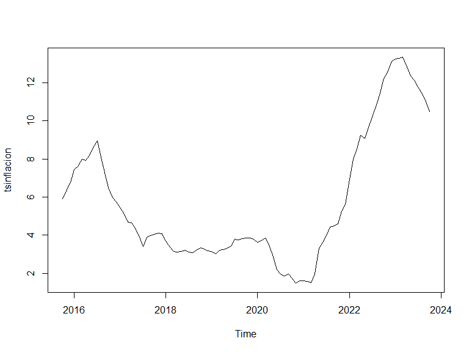
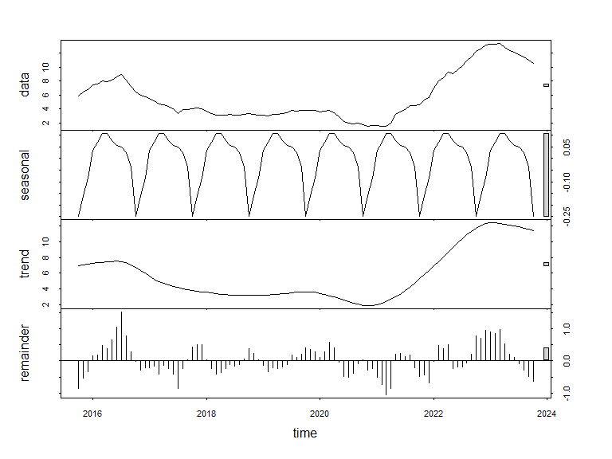
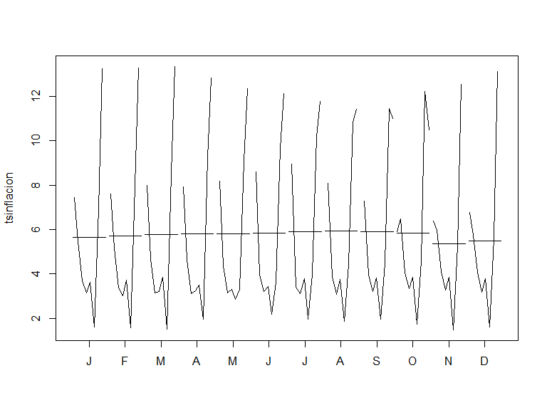
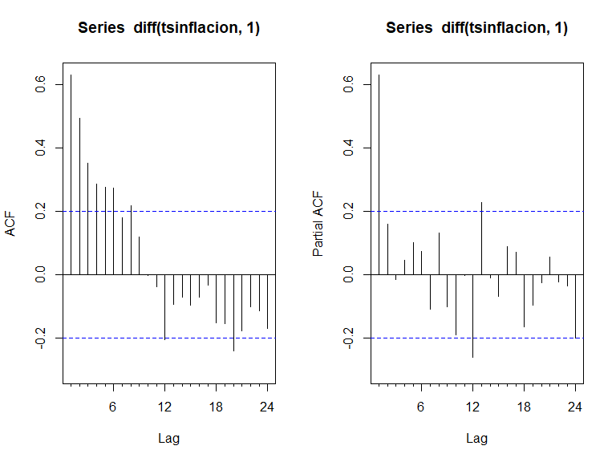
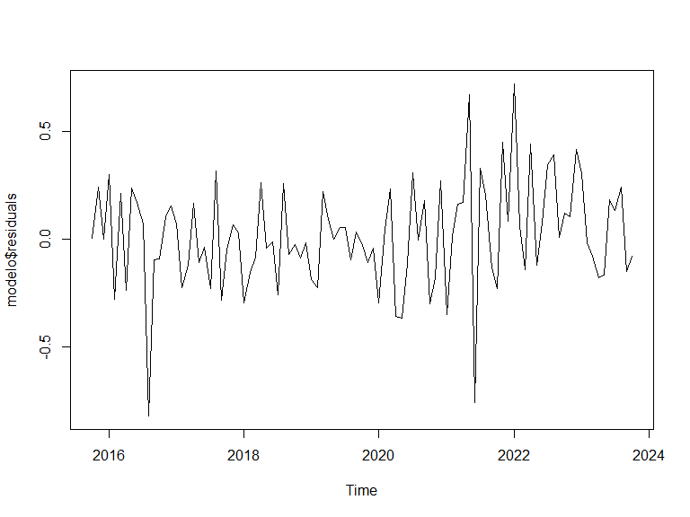
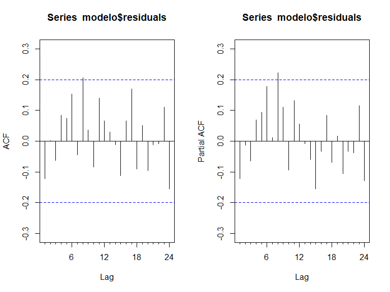
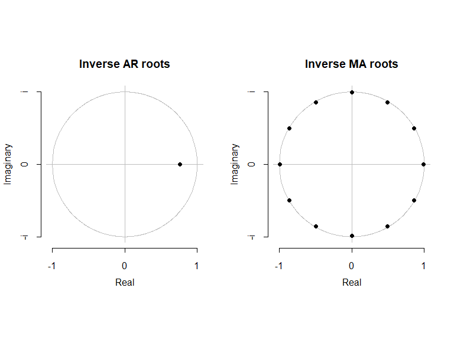
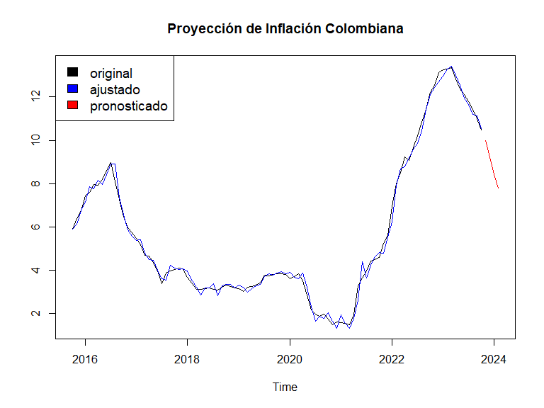
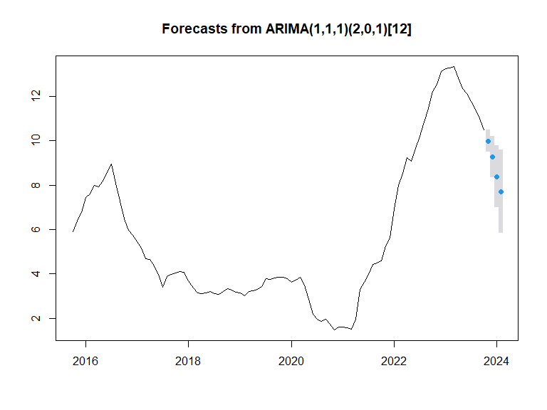
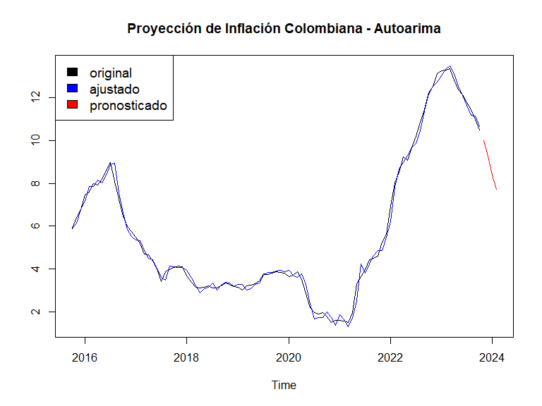

PROYECTO_MOD7_FORECASTING
================
JUAN JOSE LEON
2023-12-08

# SECCIÓN A:

# A.1) Cargando la base de datos y revisando su composición por medio de método gráfico

Se trabaja con el indicador de inflación colombiana, desde el mes de
octubre del año 2015 hasta el mes de octubre de 2023.

Para fines del ejercicio, por tener la serie una escala reducida se
trabaja en valores absolutos sin transformación logarítmica.

``` r
# Cargando las librerías

library(openxlsx)
library(forecast)
library(urca)

# Cargando la base de datos

data <- read.xlsx("C:\\Users\\ASUS_PC\\Documents\\CURSOS RSTUDIO\\PROGRAMA EXPERTO EN CIENCIA DE DATOS\\ENTREGABLES Y TRABAJOS\\MODULO 7\\INFLACION_COLOMBIA.xlsx", sheet = "Datos")

str(data)
```

    'data.frame':   97 obs. of  2 variables:
     $ FECHA    : chr  "2015/10/31" "2015/11/30" "2015/12/31" "2016/01/31" ...
     $ INFLACION: num  5.89 6.39 6.77 7.45 7.59 ...

``` r
# Utilizando la columna de inflación y convirtiendola en serie de tiempo

inflacion <- data[,2]
  
tsinflacion <- ts(as.vector(as.matrix(inflacion)), start = c(2015,10), frequency = 12)

# Revisando la serie por método gráfico

ts.plot(tsinflacion)
```



``` r
plot(stl(tsinflacion, s.window = "period"))
```



``` r
monthplot(tsinflacion)
```



``` r
# Se observa que la serie parece no tener un comportamiento estacional marcado, pero en cuanto a tendencia se observa una dinámica importante desde el año 2021 al alza 
```

# A.2) Realizando contrastes de raiz unitaria

``` r
# 1) AUGMENTED DICKEY FULLER UNIT ROOT TEST

# H0 = Raiz Unitaria = No es estacionaria
# H1 = No raiz Unitaria = Es estacionaria

adftest <- ur.df(tsinflacion, type = c("trend"), selectlags = c("BIC"))

summary(adftest)
```


    ############################################### 
    # Augmented Dickey-Fuller Test Unit Root Test # 
    ############################################### 

    Test regression trend 


    Call:
    lm(formula = z.diff ~ z.lag.1 + 1 + tt + z.diff.lag)

    Residuals:
         Min       1Q   Median       3Q      Max 
    -0.96541 -0.17435 -0.04495  0.16310  1.02612 

    Coefficients:
                 Estimate Std. Error t value Pr(>|t|)    
    (Intercept)  0.002798   0.077611   0.036    0.971    
    z.lag.1     -0.017316   0.010670  -1.623    0.108    
    tt           0.002145   0.001350   1.589    0.116    
    z.diff.lag   0.630873   0.081926   7.700 1.59e-11 ***
    ---
    Signif. codes:  0 '***' 0.001 '**' 0.01 '*' 0.05 '.' 0.1 ' ' 1

    Residual standard error: 0.3245 on 91 degrees of freedom
    Multiple R-squared:  0.4318,    Adjusted R-squared:  0.4131 
    F-statistic: 23.05 on 3 and 91 DF,  p-value: 3.447e-11


    Value of test-statistic is: -1.6229 1.2709 1.8737 

    Critical values for test statistics: 
          1pct  5pct 10pct
    tau3 -4.04 -3.45 -3.15
    phi2  6.50  4.88  4.16
    phi3  8.73  6.49  5.47

``` r
# Se observa un valor calculado de -1.6229 el cual no supera los valores críticos, por lo cua lse acepta la hipótesis nula y se determina que la serie NO es estacionaria


# 2) CONTRASTE PHILLIPS AND PERRON

# H0 = Raiz Unitaria = No es estacionaria
# H1 = No raiz Unitaria = Es estacionaria

testpp <- ur.pp(tsinflacion, type = c("Z-tau"), model = c("trend"), lags = c("short"))

summary(testpp)
```


    ################################## 
    # Phillips-Perron Unit Root Test # 
    ################################## 

    Test regression with intercept and trend 


    Call:
    lm(formula = y ~ y.l1 + trend)

    Residuals:
        Min      1Q  Median      3Q     Max 
    -0.7621 -0.2487 -0.0200  0.2314  1.1981 

    Coefficients:
                Estimate Std. Error t value Pr(>|t|)    
    (Intercept) 0.098556   0.088530   1.113   0.2685    
    y.l1        0.990778   0.013651  72.580   <2e-16 ***
    trend       0.003643   0.001674   2.176   0.0321 *  
    ---
    Signif. codes:  0 '***' 0.001 '**' 0.01 '*' 0.05 '.' 0.1 ' ' 1

    Residual standard error: 0.4179 on 93 degrees of freedom
    Multiple R-squared:  0.9856,    Adjusted R-squared:  0.9853 
    F-statistic:  3191 on 2 and 93 DF,  p-value: < 2.2e-16


    Value of test-statistic, type: Z-tau  is: -1.0393 

               aux. Z statistics
    Z-tau-mu              0.1663
    Z-tau-beta            1.6490

    Critical values for Z statistics: 
                         1pct      5pct    10pct
    critical values -4.055958 -3.456608 -3.15391

``` r
# El valor calculado con este contraste es de -1.0393 y al no exceder los valores críticos se acepta la hipótesis nula y por ende se concluye que la serie NO es estacionaria


# 3) CONTRASTE KPSS, Kwiatkowski et al. Unit Root Test

# H0 = No raiz unitaria = Es estacionaria
# H1 = Raiz Unitaria = No es estacionaria

kpsstest <- ur.kpss(tsinflacion, type = c("tau"), lags = c("short"))

summary(kpsstest)
```


    ####################### 
    # KPSS Unit Root Test # 
    ####################### 

    Test is of type: tau with 3 lags. 

    Value of test-statistic is: 0.5246 

    Critical value for a significance level of: 
                    10pct  5pct 2.5pct  1pct
    critical values 0.119 0.146  0.176 0.216

``` r
# Se obtuvo un valor calculado de 0.5246 que excede a los valores críticos, por lo tanto se rechaza Ho y se concluye que la serie NO es estacionaria


# 4) CONTRASTE ERS = Elliott, Rothenberg and Stock

# H0 = Raiz Unitaria = No es estacionaria
# H1 = No raiz Unitaria = Es estacionaria

testers <- ur.ers(tsinflacion, type = c("DF-GLS"), model = c("trend"), lag.max = 4)

summary(testers)
```


    ############################################### 
    # Elliot, Rothenberg and Stock Unit Root Test # 
    ############################################### 

    Test of type DF-GLS 
    detrending of series with intercept and trend 


    Call:
    lm(formula = dfgls.form, data = data.dfgls)

    Residuals:
         Min       1Q   Median       3Q      Max 
    -1.04493 -0.17770 -0.05687  0.13310  1.01400 

    Coefficients:
                   Estimate Std. Error t value Pr(>|t|)    
    yd.lag       -0.0208660  0.0109167  -1.911   0.0592 .  
    yd.diff.lag1  0.5255388  0.1050924   5.001 2.94e-06 ***
    yd.diff.lag2  0.1551123  0.1177414   1.317   0.1912    
    yd.diff.lag3  0.0003385  0.1179137   0.003   0.9977    
    yd.diff.lag4  0.0887666  0.1064023   0.834   0.4064    
    ---
    Signif. codes:  0 '***' 0.001 '**' 0.01 '*' 0.05 '.' 0.1 ' ' 1

    Residual standard error: 0.3224 on 87 degrees of freedom
    Multiple R-squared:  0.446, Adjusted R-squared:  0.4142 
    F-statistic: 14.01 on 5 and 87 DF,  p-value: 4.861e-10


    Value of test-statistic is: -1.9114 

    Critical values of DF-GLS are:
                     1pct  5pct 10pct
    critical values -3.58 -3.03 -2.74

``` r
# El valor calculado fue de -1.9114, valor que no excede a los valores críticos y se concluye que la serie NO es estacionaria


# 5) CONTRASTE Zivot and Andrews

# H0 = Raiz unitaria = No estacionaria
# H1 = No raiz unitaria = Es estacionaria

zatest <- ur.za(tsinflacion, model = c("both"))

summary(zatest)
```


    ################################ 
    # Zivot-Andrews Unit Root Test # 
    ################################ 


    Call:
    lm(formula = testmat)

    Residuals:
         Min       1Q   Median       3Q      Max 
    -0.81669 -0.23514  0.00781  0.16381  1.09249 

    Coefficients:
                Estimate Std. Error t value Pr(>|t|)    
    (Intercept)  0.71374    0.32194   2.217  0.02912 *  
    y.l1         0.95922    0.01365  70.293  < 2e-16 ***
    trend       -0.01165    0.04812  -0.242  0.80930    
    du          -0.78611    0.25807  -3.046  0.00303 ** 
    dt           0.02146    0.04806   0.446  0.65632    
    ---
    Signif. codes:  0 '***' 0.001 '**' 0.01 '*' 0.05 '.' 0.1 ' ' 1

    Residual standard error: 0.3712 on 91 degrees of freedom
      (1 observation deleted due to missingness)
    Multiple R-squared:  0.9889,    Adjusted R-squared:  0.9884 
    F-statistic:  2029 on 4 and 91 DF,  p-value: < 2.2e-16


    Teststatistic: -2.9884 
    Critical values: 0.01= -5.57 0.05= -5.08 0.1= -4.82 

    Potential break point at position: 10 

``` r
# El valor calculado es de -2.9884 el cual no supera a los valores críticos y por ende se determina que la serie NO es estacionaria
```

Se concluye de manera general que la serie NO es estacionaria, y por
ende se deberán aplicar diferencias sobre la misma para volverla
estacionaria.

# A.2.1) Determinando el número de diferencias para la serie

En este punto se determinará si es necesario aplicar diferencias
ordinarias y estacionales sobre la serie.

``` r
# Probando si requiere diferenciación de tipo estacional

nsdiffs(tsinflacion, test = c("ocsb"))
```

    [1] 0

``` r
nsdiffs(tsinflacion, test = c("ch"))
```

    [1] 0

``` r
# Bajo los dos contrastes se determina que la serie no requiere transformaciones para el factor estacional.


# Probando si requiere diferenciación ordinaria

ndiffs(tsinflacion, test = c("kpss"))
```

    [1] 1

``` r
ndiffs(tsinflacion, test = c("pp"))
```

    [1] 1

``` r
# Se determina que la serie requiere una diferenciación de tipo ordinaria para la construcción del modelo
```

# SECCIÓN B:

# B.1) Revisión de las funciones FAC y FAP

``` r
par(mfrow = c(1,2))
Acf(diff(tsinflacion,1))
Pacf(diff(tsinflacion,1))
```



``` r
# Con la función FAP se puede concluir que los siguientes rezagos pueden ser significativos en el modelo: SAR12, AR1

# Con la función FAC se determinan los siguientes posibles rezagos para la modelación: SMA12, SMA24, MA1, entre otros.
```

# B.2) Construcción y Evaluación del modelo

``` r
# ---- ESTIMANDO EL MODELO ----

# Luego de pruebas realizadas se determinó que el posible mejor modelo es el siguiente; 

# MODELO SARIMA(1,1,0)(0,0,1)

modelo <- Arima(tsinflacion, order = c(1,1,0), seasonal = list(order = c(0,0,1)))

summary(modelo)
```

    Series: tsinflacion 
    ARIMA(1,1,0)(0,0,1)[12] 

    Coefficients:
            ar1     sma1
          0.764  -0.8999
    s.e.  0.066   0.2690

    sigma^2 = 0.06301:  log likelihood = -11.9
    AIC=29.79   AICc=30.05   BIC=37.49

    Training set error measures:
                         ME      RMSE      MAE         MPE    MAPE       MASE
    Training set 0.01621846 0.2471021 0.186916 -0.04553395 4.50431 0.07489289
                       ACF1
    Training set -0.1222577

``` r
# Las pruebas de significancia individual de los coeficientes presentó los siguientes resultados

coeficientes <- as.matrix(abs(subset(modelo$coef, abs(modelo$coef)>0)))

secoeficientes <- as.matrix(diag(abs(modelo$var.coef)^(1/2)))

coeficientes / secoeficientes
```

              [,1]
    ar1  11.572515
    sma1  3.345469

``` r
# ---- EVALUANDO EL MODELO ----

# Probando la estabilidad en los componentes AR del modelo:

0.764
```

    [1] 0.764

``` r
# Por lo tanto, el modelo no es explosivo


# REVISANDO EL ACCURACY

accuracy(modelo)
```

                         ME      RMSE      MAE         MPE    MAPE       MASE
    Training set 0.01621846 0.2471021 0.186916 -0.04553395 4.50431 0.07489289
                       ACF1
    Training set -0.1222577

``` r
# Se observa un MAPE de 4.50%% y un MAE de 0.1869


# EVALUANDO LOS RESIDUOS DEL MODELO 

plot(modelo$residuals)
```



``` r
# Haciendo contraste formal de residuos

Box.test(modelo$residuals, type = c("Ljung-Box"))
```


        Box-Ljung test

    data:  modelo$residuals
    X-squared = 1.4952, df = 1, p-value = 0.2214

``` r
# H0 = Residuos independientes = ruido blanco
# H1 = Residuos no independientes = No son ruido blanco

# El valor p es 0.2214 y por ser mayor que 0.05 se acepta la hipotesis nula y se concluye que los residuos son Ruido Blanco = INDEPENDIENTES


# Validando el correlograma de los residuos; en este caso no se usan diferencias y quedan así

par(mfrow = c(1,2))
Acf(modelo$residuals)
Pacf(modelo$residuals)
```



``` r
# Se observa que no hay más de un rezago que supera los intervalos de confianza


# GRÁFICO DE RAIZ UNITARIA EN R

plot(modelo)
```



``` r
# CONCLUSIÓN: El modelo presetna independencia en los residuos y son ruido blanco
```

# B.3) Realizando pronóstico de 4 periodos

``` r
pronostico <- forecast(modelo, h = 4, level = c(95))

# Graficando los pronósticos

plot(pronostico)
```


``` r
# Comparando los datos originales, los ajustados y añadiendo las 4 proyecciones

cols <- c("black", "blue", "red")
ts.plot(tsinflacion, pronostico$fitted, pronostico$mean, col = cols, main = "Proyección de Inflación Colombiana")
legend("topleft", c("original", "ajustado", "pronosticado"), cex = 1.2, fill = cols)
```



# B.3) Estimando un modelo con la función auto.arima y haciendo pronóstico de 4 periodos

``` r
autoarima <- auto.arima(tsinflacion)

summary(autoarima)
```

    Series: tsinflacion 
    ARIMA(1,1,1)(2,0,1)[12] 

    Coefficients:
             ar1      ma1    sar1     sar2     sma1
          0.8793  -0.3047  0.0371  -0.1552  -0.8417
    s.e.  0.0802   0.1839  0.2203   0.1801   0.3744

    sigma^2 = 0.06275:  log likelihood = -9.32
    AIC=30.64   AICc=31.58   BIC=46.02

    Training set error measures:
                         ME      RMSE       MAE       MPE     MAPE      MASE
    Training set 0.01295004 0.2426354 0.1863994 0.1324169 4.551776 0.0746859
                       ACF1
    Training set 0.03495087

``` r
# El mejor modelo originado automáticamente fue un SARIMA(1,1,1)(2,0,1)
# En este caso se obtuvo un MAPE de 4.5517 y un MAE de 0.1863 los cuales presentan un menor desempeño respecto el modelo inicial
# En contraste, los criterios AIC y BIC mejoran con el modelo autoarima, aunque hay que considerar que presenta coeficientes individuales no significativos el modelo automático.


# ---- REALIZANDO PRONÓSTICO DE 4 PERIODOS ----

pronosticoautoarima <- forecast(autoarima, h = 4, level = c(95))

plot(pronosticoautoarima)
```



``` r
# Comparando los datos originales, los ajustados y añadiendo las 4 proyecciones

cols <- c("black", "blue", "red")
ts.plot(tsinflacion, pronosticoautoarima$fitted, pronosticoautoarima$mean, col = cols, main = "Proyección de Inflación Colombiana - Autoarima")
legend("topleft", c("original", "ajustado", "pronosticado"), cex = 1.2, fill = cols)
```



# COMENTARIOS FINALES DE LAS PROYECCIONES

Los modelos construidos y las proyecciones presenta un buen desempeño a
la luz del contexto económico colombiano, el cual ha estado marcado por
alzas de tasas de interés que buscan reducir la tasa de inflación.

Es así como el modelo inicial apunta a una inflación para finales de
2023 de 9,25 y el autoarima de 9,28 los cuales contrastan favorablemente
con las proyecciones del ministerio de hacienda colombiano que apunta a
cerrar el año con una inflación de 9,23%.
