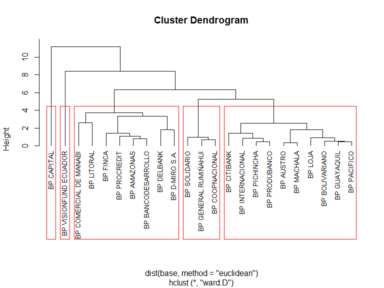
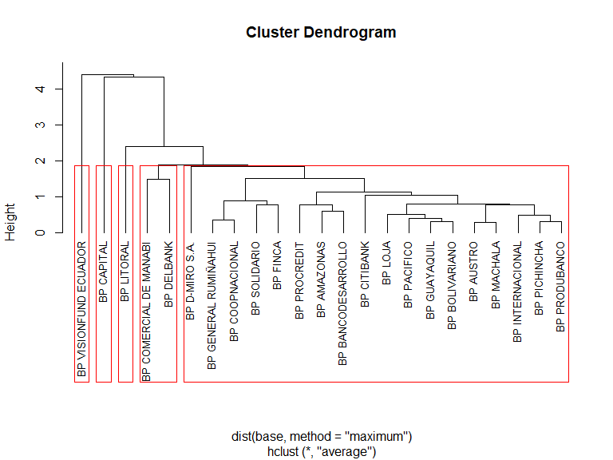
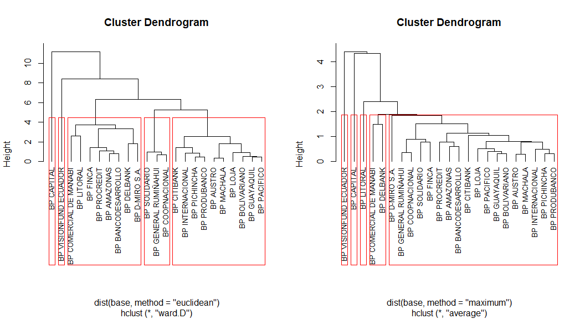
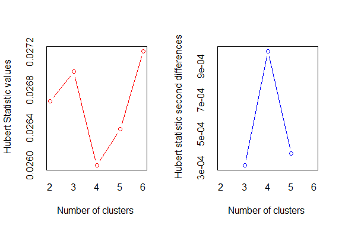
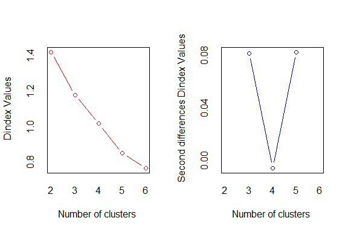
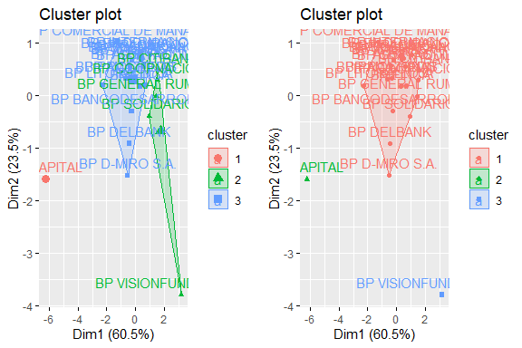
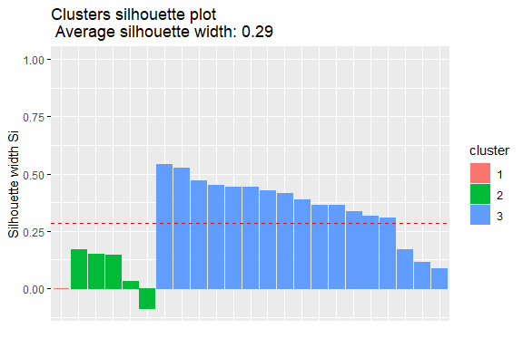
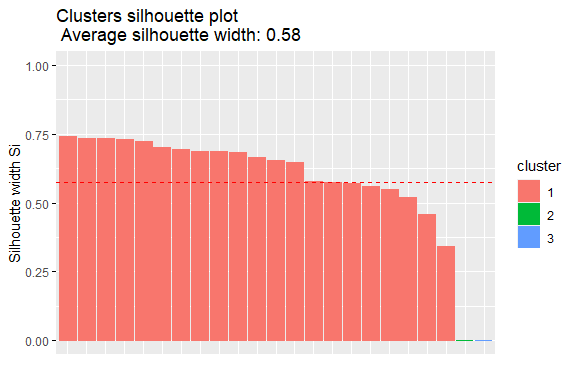

PROYECTO FINAL MODULO 5
================
JUAN JOSE LEON
2023-11-29

# LLAMANDO LAS LIBRERÍAS Y DEPURANDO LA BASE DE DATOS

``` r
# Cargando librerías

library(openxlsx)
library(cluster)
library(devtools)
library(factoextra)
library(fpc)
library(NbClust)
library(gridExtra)

# Cargando la base de datos

data <- read.xlsx("C:\\Users\\ASUS_PC\\Documents\\CURSOS RSTUDIO\\PROGRAMA EXPERTO EN CIENCIA DE DATOS\\BASES_DATOS_BASES\\MODULO 5 MACHINE LEARNING I\\MACHINE LEARNING 1\\parte 2\\BOL_BP_MAY_ 2017_PROYECTO.xlsx")

# Ajustando la base de datos

nombres <- data$BANCOS

# Nueva base normalizada

base <- as.data.frame(scale(data[,-1]))

# Asignando los nombres

row.names(base) <- nombres
```

# CONSTRUCCIÓN DE CLUSTER JERÁRQUICO

# Primera Opción:

Distancias: Euclidean

Método de Clasificación: ward.D

``` r
# Construyendo el primer cluster jerárquico

cluster1 <- hclust(dist(base, method = "euclidean"), 
                  method = "ward.D")

# Graficando

plot(cluster1, hang = -0.01, cex = 0.8)

# Diseñando 5 posibles segmentos generales

plot(cluster1, hang = -0.01, cex = 0.8)
rect.hclust(cluster1, k = 5, border = "red")
```



# Segunda Opción:

Distancias: maximum

Método de Clasificación: average

``` r
# Construyendo el segundo cluster jerárquico

cluster2 <- hclust(dist(base, method = "maximum"), 
                  method = "average")

# Graficando

plot(cluster2, hang = -0.01, cex = 0.8)

# Diseñando 5 posibles segmentos generales

plot(cluster2, hang = -0.01, cex = 0.8)
rect.hclust(cluster2, k = 5, border = "red")
```



# Comparando los 2 cluster jerárquicos construidos:

``` r
par(mfrow = c(1,2))
plot(cluster1, hang = -0.01, cex = 0.8)
rect.hclust(cluster1, k = 5, border = "red");
plot(cluster2, hang = -0.01, cex = 0.8)
rect.hclust(cluster2, k = 5, border = "red")
```



Al cambiar las distancias y el método se obtiene que las agrupaciones
son similares si se generalizan tres grupos; pero al ampliar el tamaño
de grupos a 4 o 5 grupos generales como se observa en la gráfica, hay
diferencias importantes en los cluster. La agrupación por 3 cluster se
ratifica cuando se usan modelos no jerárquicos como se verá mas
adelante.

Resaltan los casos de BpCapital y de Bp Visionfund Ecuador, que en las
distingas agrupaciones probadas quedan en cluster separados o
independientes. Así mismo, en las distintas combinaciones tienen a
quedar en un mismo grupo los bancos Bp Delbank y BP Comercial de Manabi.

# CONSTRUCCIÓN DE CLUSTER NO JERÁRQUICO

``` r
# Optimizando el número de cluster

clusteroptimo <- NbClust(base, distance = "euclidean", min.nc = 2, max.nc = 6, method = "ward.D", index = "all")
```



    *** : The Hubert index is a graphical method of determining the number of clusters.
                    In the plot of Hubert index, we seek a significant knee that corresponds to a 
                    significant increase of the value of the measure i.e the significant peak in Hubert
                    index second differences plot. 
     



    *** : The D index is a graphical method of determining the number of clusters. 
                    In the plot of D index, we seek a significant knee (the significant peak in Dindex
                    second differences plot) that corresponds to a significant increase of the value of
                    the measure. 
     
    ******************************************************************* 
    * Among all indices:                                                
    * 6 proposed 2 as the best number of clusters 
    * 13 proposed 3 as the best number of clusters 
    * 2 proposed 4 as the best number of clusters 
    * 1 proposed 5 as the best number of clusters 
    * 2 proposed 6 as the best number of clusters 

                       ***** Conclusion *****                            
     
    * According to the majority rule, the best number of clusters is  3 
     
     
    ******************************************************************* 

``` r
# Se concluye que el número de cluster óptimo es 3


# Cluster no jerárquico usando k medias: Se usan 3 cluster porque es el número optimizado anteriormente

kmedias <- kmeans(base, 3)

kmedias
```

    K-means clustering with 3 clusters of sizes 1, 5, 17

    Cluster means:
      ACTIVOS.PRODUCTIVOS./.TOTAL.ACTIVOS MOROSIDAD.DE.LA.CARTERA.TOTAL
    1                          -1.8127067                    3.59686390
    2                           1.2062846                   -0.58778421
    3                          -0.2481598                   -0.03870252
      GASTOS.DE.OPERACION./.MARGEN.FINANCIERO
    1                              4.13445549
    2                             -0.54098996
    3                             -0.08408857
      RESULTADOS.DEL.EJERCICIO./.ACTIVO.PROMEDIO
    1                                 -2.8225866
    2                                  0.9531444
    3                                 -0.1143021
      FONDOS.DISPONIBLES./.TOTAL.DEPOSITOS.A.CORTO.PLAZO
    1                                         -0.3471037
    2                                          0.7484362
    3                                         -0.1997104

    Clustering vector:
              BP GUAYAQUIL            BP PACIFICO           BP PICHINCHA 
                         3                      3                      3 
             BP PRODUBANCO              BP AUSTRO         BP BOLIVARIANO 
                         3                      3                      3 
               BP CITIBANK   BP GENERAL RUMIÑAHUI       BP INTERNACIONAL 
                         2                      2                      3 
                   BP LOJA             BP MACHALA           BP SOLIDARIO 
                         3                      3                      2 
              BP PROCREDIT            BP AMAZONAS BP COMERCIAL DE MANABI 
                         3                      3                      3 
                BP LITORAL        BP COOPNACIONAL             BP CAPITAL 
                         3                      2                      1 
                  BP FINCA             BP DELBANK         BP D-MIRO S.A. 
                         3                      3                      3 
        BP BANCODESARROLLO  BP VISIONFUND ECUADOR 
                         3                      2 

    Within cluster sum of squares by cluster:
    [1]  0.00000 18.95853 29.73459
     (between_SS / total_SS =  55.7 %)

    Available components:

    [1] "cluster"      "centers"      "totss"        "withinss"     "tot.withinss"
    [6] "betweenss"    "size"         "iter"         "ifault"      

``` r
# Cluster no jerárquico usando k medoid

medoides <- pam(base, 3)

medoides
```

    Medoids:
                          ID ACTIVOS.PRODUCTIVOS./.TOTAL.ACTIVOS
    BP PRODUBANCO          4                          -0.1576594
    BP CAPITAL            18                          -1.8127067
    BP VISIONFUND ECUADOR 23                           1.7880552
                          MOROSIDAD.DE.LA.CARTERA.TOTAL
    BP PRODUBANCO                            -0.6243136
    BP CAPITAL                                3.5968639
    BP VISIONFUND ECUADOR                    -0.3408908
                          GASTOS.DE.OPERACION./.MARGEN.FINANCIERO
    BP PRODUBANCO                                      -0.2953297
    BP CAPITAL                                          4.1344555
    BP VISIONFUND ECUADOR                              -0.4479673
                          RESULTADOS.DEL.EJERCICIO./.ACTIVO.PROMEDIO
    BP PRODUBANCO                                         0.05888987
    BP CAPITAL                                           -2.82258662
    BP VISIONFUND ECUADOR                                 2.01635135
                          FONDOS.DISPONIBLES./.TOTAL.DEPOSITOS.A.CORTO.PLAZO
    BP PRODUBANCO                                                 -0.4915569
    BP CAPITAL                                                    -0.3471037
    BP VISIONFUND ECUADOR                                          4.1995802
    Clustering vector:
              BP GUAYAQUIL            BP PACIFICO           BP PICHINCHA 
                         1                      1                      1 
             BP PRODUBANCO              BP AUSTRO         BP BOLIVARIANO 
                         1                      1                      1 
               BP CITIBANK   BP GENERAL RUMIÑAHUI       BP INTERNACIONAL 
                         1                      1                      1 
                   BP LOJA             BP MACHALA           BP SOLIDARIO 
                         1                      1                      1 
              BP PROCREDIT            BP AMAZONAS BP COMERCIAL DE MANABI 
                         1                      1                      1 
                BP LITORAL        BP COOPNACIONAL             BP CAPITAL 
                         1                      1                      2 
                  BP FINCA             BP DELBANK         BP D-MIRO S.A. 
                         1                      1                      1 
        BP BANCODESARROLLO  BP VISIONFUND ECUADOR 
                         1                      3 
    Objective function:
       build     swap 
    1.231795 1.231795 

    Available components:
     [1] "medoids"    "id.med"     "clustering" "objective"  "isolation" 
     [6] "clusinfo"   "silinfo"    "diss"       "call"       "data"      

``` r
# Graficando los dos cluster construidos:

gk <- fviz_cluster(kmedias, data = base)

gm <- fviz_cluster(medoides, data = base)

grupo <- grid.arrange(gk, gm, ncol = 2)
```



``` r
# Comprobando la capacidad de clasificación

# Método Kmedias = indicador de clasificación del 0.58

silueta <- silhouette(kmedias$cluster, dist(base, method = "euclidean"))

fviz_silhouette(silueta)
```

      cluster size ave.sil.width
    1       1    1          0.00
    2       2    5          0.08
    3       3   17          0.36



``` r
# Método k medoids = indicador de clasificación del 0.58

silueta <- silhouette(medoides$cluster, dist(base, method = "euclidean"))

fviz_silhouette(silueta)
```

      cluster size ave.sil.width
    1       1   21          0.63
    2       2    1          0.00
    3       3    1          0.00



Conclusión de Cluster No Jerárquico: personalmente, observo una mayor
estabilidad en los grupos diseñados utilizando el algoritmo de k medoids
ya que mantiene las agrupaciones construidas, mientras que K medias
tiende a variar siempre que se vuelve a ejecutar el algoritmo.
